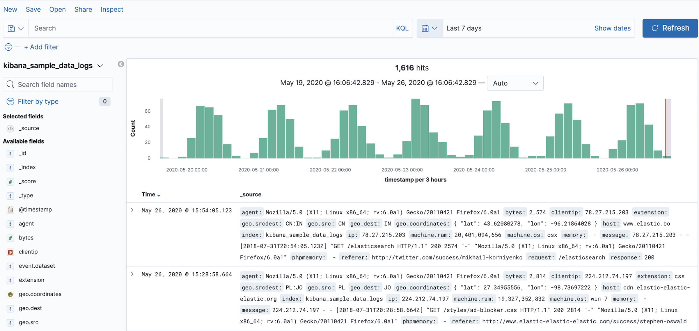

# Log collection part 13 (waxing philosophical)

Let's take a step back and think about the architecture of `monitoring-rs`.
Why?
Because it's interesting, and might give us some insights that we can apply to the implementation.

**Trigger warning:** this article contains lots of unsubstantiated conjecture about performance.

## Thinking about `Collector`

So far, to keep things simple, our architecture revolves around a `LogEntry` struct and `Collector` trait, which is currently just a 'supertrait' of `Iterator`:

```rust
struct LogEntry {
    line: String,
    metadata: HashMap<String, String>,
}

trait Collector: Iterator<Item = io::Result<LogEntry>> {}
```

There are some aspects of this model that are not ideal:

- Metadata has to be cloned for every `LogEntry`.
  This is particularly sub-optimal because metadata is determined by the log file, and will be the same for every entry from that file.
- The use of `Iterator` as the interface means all log entries from all files must be serialised.
- Every entry emitted by a `Collector` could be an `io::Error`, with no way of distinguishing between errors handling a single entry and errors with the entire collector.
- An error with the entire collector would affect all sources of logs – e.g. a single corrupt log file could bring the whole monitor down.

Thinking about the 'domain model', we could call out `log entry`s and `log file`s separately.
This should be useful, since in a live environment we could have dozens to few hundreds of log files, but potentially hundreds of thousands or even millions of log entries across those files.
With that in mind, it seems clear that it would be worth minimising the cost of handling each `log entry`, and handling those costs at the `log file` level would be a reasonable approach.
In particular, we could say that metadata is set at the `log file` level.

This model could also help our concurrency/parallelism concerns.
A characteristic of `log file`s would be that they emit `log entry`s sequentially, but there are no such constraints between `log file`s.
This would allow each `log file`'s entries to be processed in parallel.

How might an evolution of our architecture look that captures `log file`?
What about:

```rust
struct LogEntry {
    line: String
}

trait LogFile: Iterator<Item = LogEntry> {
    fn metadata(&self) -> &HashMap<String, String>;
}

trait Collector<F: LogFile>: Iterator<Item = F> {}
```

In this API, we've:

- Removed `metadata` from `LogEntry`.
- Created a `LogFile` trait that emits `LogEntry`, and has a method for getting a reference to `metadata`.
- Updated `Collector` to emit `LogFile`s.

This would allow `LogFile`s to be pulled from a `Collector`.
These `LogFile`s could then be iterated in parallel, and the cost of each entry would be reduced to the cost of a single `String` for the line (we could even go right down to bytes, and worry about UTF-8 validation at time of retrieval).

Given this simplification, we could imagine another simplification that completely eliminates `LogEntry` and `LogFile`:

```rust
trait Collector<Source>: Iterator<Item = (HashMap<String, String>, Source)>
where
    Source: Iterator<Item = String>
{
}
```

Here, we've:

- Replaced `LogEntry` with `String`.
- Changed `Collector` to be generic over a type `Source` that implements `Iterator<Item = String>` (one half of `LogFile`'s API).
- Changed `Collector` to emit `(HashMap<String, String>, Source)`.

This would require the orchestrator of `Collector` to manage the association between log sources and their metadata.
Could this be a problem?
Perhaps we need to think more about how `Collector` will be used.

## Thinking about `Stream`

Since we're now talking about concurrency and interation, it's probably worth looking at [`futures::stream::Stream`](https://docs.rs/futures/0.3/futures/stream/trait.Stream.html).

> A stream of values produced asynchronously.
>
> If `Future<Output = T>` is an asynchronous version of `T`, then `Stream<Item = T>` is an asynchronous version of `Iterator<Item = T>`.
> A stream represents a sequence of value-producing events that occur asynchronously to the caller.
>
> The trait is modeled after `Future`, but allows `poll_next` to be called even after a value has been produced, yielding None once the stream has been fully exhausted.

The interesting key part of this is "[a] stream represents a sequence of value-producing events that occur asynchronously to the caller".
The most relevant pattern this would enable for our use-case would be the ability to poll multiple `Stream`s concurrently.

If we are using an `Iterator`-based API, we could interleave items from multiple iterators, but if one iterator blocks, the other iterator will not be advanced:

```rust
fn main() {
    let mut iter_a = (0..5).into_iter();
    let mut iter_b = (5..10).into_iter();

    // `iter_b` will not be called until `iter_a.next()` returns
    while let Some(item) = iter_a.next().or_else(|| iter_b.next()) {
        println!("{}", item);
        std::mem::swap(&mut iter_a, &mut iter_b);
    }
}
```

This could be problematic for our use-case if `iter_a` and `iter_b` both represent `log file`s, but one is written to frequently whilst the other is written to very rarely.
In a logging context, this could be the difference between writing to one file multiple times a second and the other once a day – we would not want to be blocked on the latter whilst events queue up for the former!

However, it's possible to poll to `Stream`s concurrently and react the first events that come in from any stream:

```rust
use futures::stream::{self, StreamExt};

#[async_std::main]
async fn main() {
    let stream_a = stream::iter(0..5);
    let stream_b = stream::iter(5..10);
    let mut combined = stream::select(stream_a, stream_b);

    while let Some(item) = combined.next().await {
        println!("{}", item);
    }
}
```

Of course, internally `combined` will poll one of `stream_a` and `stream_b` first.
Since the items are futures, however, there is little time lost if the first stream has no value ready (and in fact [the `Select` implementation](https://docs.rs/futures-util/0.3.12/src/futures_util/stream/select.rs.html#96-100) includes a flag to alternate which is polled first).

We *could* achieve something similar with `Iterator` by using threads, e.g.:

```rust
use std::sync::mpsc;
use std::thread;

fn main() {
    let iter_a = (0..5).into_iter();
    let iter_b = (5..10).into_iter();

    let (tx, rx) = mpsc::channel();

    let thread_a = {
        let tx = tx.clone();
        thread::spawn(move || {
            for a in iter_a {
                tx.send(a).unwrap();
            }
        })
    };

    let thread_b = thread::spawn(move || {
        for b in iter_b {
            tx.send(b).unwrap();
        }
    });

    for item in rx {
        // do something with `item`
        println!("{}", item);
    }

    thread_a.join().unwrap();
    thread_b.join().unwrap();
}
```

In our situation, where we may have dozens to few hundreds of `Iterator`s, the cost of all that context switching is likely to be high, particularly in a shared-compute environment like Kubernetes.

How does the current implementation compare to these?
It's actually not too dire thanks to the `watcher` being the root of the iteration.
The underlying file system notifier (`inotify` or `kqueue`) essentially ensures that we only 'poll' files that have content to poll.
Both `inotify` and `kqueue` merge duplicate events and use a queue of events internally, which should mean that particularly busy files can't block quieter files forever.
Essentially, we expect `watcher` to give us fair interleaving – but this only holds if the cost of processing each event is similar.
For example, when using the `directory` collector, events for new files require substantially more work (opening files, registering new watches) than events for updates to already registered files (read new data).
This could limit the maximum throughput for log entries, although we're getting *very* unuibstantiated now.

At any rate, this suggests that concurrency might not be a critical concern for the current architecture, as long as a shared `watcher` remains the ultimate source of entries.
However, if we break out seperate iterators per `log file`, we would still need to be able to multiplex across them...
Let's go back to considering `Collector` orchestration.

## Back to `Collector` orchestration

That was a bit of a tangent, but we've got a bit more context about concurrency.
Let's go back to thinking about these two possible APIs that introduce a `log file` element:

```rust
struct LogEntry {
    line: String
}

trait LogFile: Iterator<Item = LogEntry> {
    fn metadata(&self) -> &HashMap<String, String>;
}

trait Collector<F: LogFile>: Iterator<Item = F> {}
```

Versus:

```rust
trait Collector<Source>: Iterator<Item = (HashMap<String, String>, Source)>
where
    Source: Iterator<Item = String>
{
}
```

The key difference is who owns the metadata.
In the first, the `LogFile` implementor owns it, and can return a reference to the orchestrator via `metadata()`.
In the second, the orchestrator owns it.

Our current 'orchestrator' is the `run_collector` function in `main`:

```rust
fn run_collector(collector: Box<dyn Collector>, database: Arc<RwLock<Database>>) -> io::Result<()> {
    for entry in collector {
        let entry = entry?;
        let mut database = task::block_on(database.write());
        database.write(&entry)?;
    }
    Ok(())
}
```

Let's take out some of the 'details' and focus on the high-level shape:

```rust
fn run_collector(collector: impl Collector, database: Database) {
    for entry in collector {
        database.write(&entry);
    }
}
```

Let's also imagine that `Database::write` takes the `metadata` and `line` separately:

```rust
fn run_collector(collector: impl Collector, database: Database) {
    for entry in collector {
        database.write(&entry.metadata, &entry.line);
    }
}
```

Now we can rework this based on our first alternative API:

```rust
fn run_collector(collector: impl Collector, database: Database) {
    for file in collector {
        for line in file {
            database.write(file.metadata(), &line);
        }
    }
}
```

This implementation would be very flawed, since we try to exhaust an entire file before pulling lines from any other file.
(*Unless* the `LogFile` was transient and only contained available lines – e.g. a 'batch' of available lines and their metadata, rather than a persistent structure representing a `log file`... but let's put that thought to one side for now.)

We've already considered the different options for multiplexing several iterators fairly.
Sadly, we cannot simply use `Stream`s here since the `file`s are not themselves `Stream`s.
We could convert them to a `Stream` using `stream::iter`, but internally that will [directly call `next`](https://docs.rs/futures-util/0.3.12/src/futures_util/stream/iter.rs.html#42), so we would see the same behaviour.

Could we do this with threads?

```rust
fn run_collector(collector: impl Collector, database: Database) {
    let threads = Vec::new();
    for file in collector {
        let database = database.clone();
        threads.push(thread::spawn(move || {
            for line in file {
                database.write(file.metadata(), &line);
            }
        }));
    }
    for thread in threads {
        thread.join();
    }
}
```

This actually doesn't look too unreasonable, although we could end up with an unbounded number of threads – potentially very many on a large Kubernetes node.
It also seems quite wasteful when the underlying `watcher` source is essentially single-threaded.

Before we go further, let's have a look at the second alternative API:

```rust
fn run_collector(collector: impl Collector, database: Database) {
    for (metadata, source) in collector {
        for line in source {
            database.write(&metadata, &line);
        }
    }
}
```

This looks pretty similar really.
We have the same issue with concurrency, and a similar threaded approach looks reasonable:

```rust
fn run_collector(collector: impl Collector, database: Database) {
    let threads = Vec::new();
    for (metadata, source) in collector {
        threads.push(thread::spawn(move || {
            for line in source {
                database.write(&metadata, &line);
            }
        }));
    }
    for thread in threads {
        thread.join();
    }
}
```

So, there doesn't really seem to be much cost/benefit between either API.

## But what's the point?

Well, that was indeed interesting.
Although we didn't really reach any stunning conclusions, it should give us something to think about in future.

For now let's revisit the 'low hanging fruit' suggested at the end of the last post:

> - Introduce some caching into `kubernetes::Collector` to avoid re-parsing file names and re-querying metadata.
> - Introduce some deployment commands to the `Makefile`, to allow us to actually deploy our monitor to a cluster and see how it performs.

We could solve our `kubernetes::Collector` caching by refactoring the whole system to separate the metadata setup costs from per-line activity.
However, an easier solution in the short term would be to simply introduce caching, so let's do just that:

```diff
--- a/src/log_collector/kubernetes.rs
+++ b/src/log_collector/kubernetes.rs
@@ -1,7 +1,7 @@
 // src/log_collector/kubernetes.rs
 //! A log collector that collects logs from containers on a Kubernetes node.

-use std::collections::BTreeMap;
+use std::collections::{BTreeMap, HashMap};
 use std::io;
 use std::path::{Path, PathBuf};

@@ -57,6 +57,7 @@ pub fn initialize(config: Config) -> io::Result<impl super::Collector> {
             },
             watcher,
         )?,
+        metadata_cache: HashMap::new(),
     })
 }

@@ -69,6 +70,7 @@ struct Collector<W: Watcher> {
     kube_client: kube::Client,
     kube_resource: kube::Resource,
     directory: directory::Collector<W>,
+    metadata_cache: HashMap<String, HashMap<String, String>>,
 }

 impl<W: Watcher> Collector<W> {
@@ -120,24 +122,25 @@ impl<W: Watcher> Iterator for Collector<W> {
         Some(entry.map(|mut entry| {
             // `unwrap` is OK since we know `directory` always sets `path`.
             let path = entry.metadata.remove("path").unwrap();
-            let [pod_name, namespace, container_name, container_id] = Self::parse_path(&path);
-            entry
-                .metadata
-                .insert("pod_name".to_string(), pod_name.to_string());
-            entry
-                .metadata
-                .insert("namespace".to_string(), namespace.to_string());
-            entry
-                .metadata
-                .insert("container_name".to_string(), container_name.to_string());
-            entry
-                .metadata
-                .insert("container_id".to_string(), container_id.to_string());
+            let metadata = if let Some(metadata) = self.metadata_cache.get(&path) {
+                metadata
+            } else {
+                let mut metadata = HashMap::new();
+
+                let [pod_name, namespace, container_name, container_id] = Self::parse_path(&path);
+                metadata.insert("pod_name".to_string(), pod_name.to_string());
+                metadata.insert("namespace".to_string(), namespace.to_string());
+                metadata.insert("container_name".to_string(), container_name.to_string());
+                metadata.insert("container_id".to_string(), container_id.to_string());
+
+                for (key, value) in self.query_pod_metadata(namespace, pod_name) {
+                    metadata.insert(key, value);
+                }

-            for (key, value) in self.query_pod_metadata(namespace, pod_name) {
-                entry.metadata.insert(key, value);
-            }
+                self.metadata_cache.entry(path).or_insert(metadata)
+            };

+            entry.metadata = metadata.clone();
             entry
         }))
     }
```

We're very simply caching the metadata that we found for each `path` that we see.
As with everything we've done so far, this 'tends to infinity' very poorly since we never evict log files.

## Monitoring our monitoring

If we went ahead and deployed our monitoring binary to Kubernetes right now, we'd have a hard time knowing what's going on with it.
In order to avoid a recursive logging explosion, we would probably want to disable the per-entry debug logging we currently employ.
Whilst our Kubernetes metadata would make it easier to find logs for a given service, it would be useful to be able to get a summary of what's been collected.
Let's add a couple of 'summary' methods to `Database` that we can then expose via the API:

```diff
--- a/src/log_database/mod.rs
+++ b/src/log_database/mod.rs
@@ -2,7 +2,7 @@

 //! The interface for log storage in `monitoring-rs`.

-use std::collections::{HashMap, HashSet};
+use std::collections::{hash_map, HashMap, HashSet};
 use std::ffi::OsStr;
 use std::fs::{self, File, OpenOptions};
 use std::io::{self, BufRead, BufReader, Seek, SeekFrom, Write};
@@ -124,6 +124,18 @@ impl Database {
         })
     }

+    /// The number of log files currently being persisted.
+    #[must_use]
+    pub fn files_len(&self) -> usize {
+        self.files.len()
+    }
+
+    /// An iterator of the keys currently in the index.
+    #[must_use]
+    pub fn index_keys(&self) -> hash_map::Keys<'_, (String, String), HashSet<String>> {
+        self.index.keys()
+    }
+
     /// # Errors
     ///
     /// Propagates any `io::Error` that occurs when querying the database.
```

And now to expose them:

```diff
--- a/src/api/mod.rs
+++ b/src/api/mod.rs
@@ -19,10 +19,29 @@ pub type Server = tide::Server<State>;
 /// Initialise an instance of the `monitoring-rs` HTTP API.
 pub fn server(database: State) -> Server {
     let mut app = tide::Server::with_state(database);
+    app.at("/status").get(get_status);
     app.at("/logs/:key/*value").get(read_logs);
     app
 }

+async fn get_status(req: tide::Request<State>) -> tide::Result {
+    let database = req.state().read().await;
+    let files_len = database.files_len();
+    let index_keys = database
+        .index_keys()
+        .map(|(k, v)| format!("{}={}", k, v))
+        .collect::<Vec<_>>();
+
+    let status = serde_json::json!({
+        "files_len": files_len,
+        "index_keys": index_keys
+    });
+
+    Ok(tide::Response::builder(tide::StatusCode::Ok)
+        .body(tide::Body::from_json(&status)?)
+        .build())
+}
+
 async fn read_logs(req: tide::Request<State>) -> tide::Result {
     let key = req.param("key")?;
     let value = req.param("value")?;
```

Fantastich.
We can try out our new endpoint in Docker, but first we have to update it to use the `Directory` collector (and remove the remnants of our failed attempt to get the Kubernetes collector to work):

```diff
--- a/docker-compose.yaml
+++ b/docker-compose.yaml
@@ -8,9 +8,8 @@ services:
     - logs:/var/log/containers
     environment:
     - RUST_LOG=monitoring_rs=debug
+    - LOG_COLLECTOR=Directory
     - ROOT_PATH=/var/log/containers
-    - KUBERNETES_SERVICE_HOST=host.docker.internal
-    - KUBERNETES_SERVICE_PORT=8001
     ports:
     - 8000:8000

```

Now let's see:

```
$ make down writer monitoring
...
monitoring_1  | [2021-02-06T18:27:43Z DEBUG monitoring_rs::log_collector::directory] Initialising watch on root path "/var/log/containers"
monitoring_1  | [2021-02-06T18:27:43Z DEBUG monitoring_rs::log_collector::directory] Create /var/log/containers/writer_fake_writer_abc123.log
monitoring_1  | [2021-02-06T18:27:43Z DEBUG monitoring_rs::log_collector::directory] Append /var/log/containers/writer_fake_writer_abc123.log
...
```

And the API:

```
# in another tab
$ curl localhost:8000/status | jq
{
  "files_len": 1,
  "index_keys": [
    "path=/var/log/containers/writer_fake_writer_abc123.log"
  ]
}

```

Great.
That's probably the best we can do for now.
It would be nice to be able to get the number of stored entries, but to do so we would have to start counting them and that's probably easier said than done (e.g. we would either have to persist the count or iterate all entries when loading the DB).

## Deployment

We already have a couple of `make` tasks for deploying to Kubernetes (`kuberun` and `kubeclean`), but they're a bit hokey.
Let's create a `deployment/` directory and put a Kubernetes manifest in there for a single-replica deployment:

```
$ mkdir -p deployment
```

```yaml
# deployment/kubernetes.yaml
apiVersion: apps/v1
kind: Deployment
metadata:
  name: monitoring-rs
  labels:
    app: monitoring-rs
spec:
  replicas: 1
  selector:
    matchLabels:
      app: monitoring-rs
  template:
    metadata:
      labels:
        app: monitoring-rs
    spec:
      containers:
      - name: monitoring-rs
        image: registry.digitalocean.com/connec-co-uk/monitoring-rs:latest
        volumeMounts:
        - name: varlog
          mountPath: /var/log
          readOnly: true
        - name: varlibdockercontainers
          mountPath: /var/lib/docker/containers
          readOnly: true
      volumes:
      - name: varlog
        hostPath:
          path: /var/log
          type: Directory
      - name: varlibdockercontainers
        hostPath:
          path: /var/lib/docker/containers
          type: Directory
```

Let's also add a `make` task to build and push the docker image, and then apply the manifest:

```diff
--- a/Makefile
+++ b/Makefile
@@ -51,3 +51,6 @@ kuberun: push

 kubecleanup:
  @kubectl delete pods monitoring-rs --ignore-not-found
+
+deploy: push
+ @kubectl apply --namespace monitoring-rs -f deployment/kubernetes.yaml
```

Now we should be able to simply `make deploy`:

```
$ make deploy
...
deployment.apps/monitoring-rs created

$ kubectl -n monitoring-rs get pods
NAME                             READY   STATUS             RESTARTS   AGE
monitoring-rs-76c5f67dd4-k9f2z   0/1     CrashLoopBackOff   10         31m
```

Uh-oh, something is not right.

```
$ kubectl -n monitoring-rs describe pods
...
Containers:
  monitoring-rs:
    ...
    State:          Waiting
      Reason:       CrashLoopBackOff
    Last State:     Terminated
      Reason:       Error
      Exit Code:    101
      Started:      Sat, 06 Feb 2021 19:17:29 +0000
      Finished:     Sat, 06 Feb 2021 19:17:29 +0000
...
Events:
  Type     Reason     Age                   From               Message
  ----     ------     ----                  ----               -------
  Normal   Scheduled  31m                   default-scheduler  Successfully assigned monitoring-rs/monitoring-rs-76c5f67dd4-k9f2z to default-3xvo7
  Normal   Created    31m (x4 over 31m)     kubelet            Created container monitoring-rs
  Normal   Started    31m (x4 over 31m)     kubelet            Started container monitoring-rs
  Normal   Pulling    30m (x5 over 31m)     kubelet            Pulling image "registry.digitalocean.com/connec-co-uk/monitoring-rs:latest"
  Normal   Pulled     30m (x5 over 31m)     kubelet            Successfully pulled image "registry.digitalocean.com/connec-co-uk/monitoring-rs:latest"
  Warning  BackOff    110s (x137 over 31m)  kubelet            Back-off restarting failed container
```

OK, the pod is stuck in a crash-loop because the container keeps erroring out.
What do the logs say:

```
$ kubectl -n monitoring-rs logs -l app=monitoring-rs
thread 'blocking-1' panicked at 'called `Result::unwrap()` on an `Err` value: ["do-k8s-grafana-6c6b745b65-x2kg4", "do-k8s", "grafana-7ab36ae8dee04b0966ae5f4663d7dcbef66fb409b07d22b5ad3d6cb23a9acd88"]', /build/src/log_collector/kubernetes.rs:87:56
note: run with `RUST_BACKTRACE=1` environment variable to display a backtrace
thread 'async-std/runtime' panicked at 'task has failed', /usr/local/cargo/registry/src/github.com-1ecc6299db9ec823/async-task-4.0.3/src/task.rs:368:45
thread 'main' panicked at 'task has failed', /usr/local/cargo/registry/src/github.com-1ecc6299db9ec823/async-task-4.0.3/src/task.rs:368:45
```

`src/log_collector/kubernetes.rs:87` is:

```rust
// TODO: `unwrap` is not ideal, since log file names may not have exactly 3 underscores.
stem.split('_').collect::<Vec<_>>().try_into().unwrap()
```

It looks like, indeed, a file name has not exactly 3 underscores.
In fact, if we review the format we expect for log files:

```
<pod name>_<namespace>_<container name>-<container ID>.log
```

We're parsing them wrong!
We should split by underscore, then seperate the container name from its ID using hyphen (`-`).
Since container names can include hyphens we need to split the `<container name>-<container ID>` string on just the last hyphen.

```diff
--- a/src/log_collector/kubernetes.rs
+++ b/src/log_collector/kubernetes.rs
@@ -83,8 +83,18 @@ impl<W: Watcher> Collector<W> {
         // `unwrap` is OK since we converted from `str` above.
         let stem = stem.to_str().unwrap();

-        // TODO: `unwrap` is not ideal, since log file names may not have exactly 3 underscores.
-        stem.split('_').collect::<Vec<_>>().try_into().unwrap()
+        // TODO: `unwrap` is not ideal, since log file names may not have exactly 2 underscores.
+        let [pod_name, namespace, container]: [&str; 3] =
+            stem.split('_').collect::<Vec<_>>().try_into().unwrap();
+
+        // TODO: `unwrap` is not ideal, since the `container` component might not include `-`.
+        let [container_id, container_name]: [&str; 2] = container
+            .rsplitn(2, '-')
+            .collect::<Vec<_>>()
+            .try_into()
+            .unwrap();
+
+        [pod_name, namespace, container_name, container_id]
     }

     fn query_pod_metadata(&mut self, namespace: &str, pod_name: &str) -> BTreeMap<String, String> {
```

Not beautiful, but let's see if it works:

```
$ make deploy
...
deployment.apps/monitoring-rs unchanged

$ kubectl -n monitoring-rs get pods
NAME                             READY   STATUS             RESTARTS   AGE
monitoring-rs-76c5f67dd4-k9f2z   0/1     CrashLoopBackOff   17         66m
```

Hrm, it looks like it hasn't restarted.
This is because nothing has changed in the deployment's specification.
For now let's just delete the existing deployment and re-deploy, and we'll revisit this later:

```
$ kubectl -n monitoring-rs delete deployment monitoring-rs
deployment.apps "monitoring-rs" deleted

$ make deploy
...
deployment.apps/monitoring-rs created

$ kubectl -n monitoring-rs get pods
NAME                             READY   STATUS   RESTARTS   AGE
monitoring-rs-76c5f67dd4-mghzw   0/1     Error    1          12s
```

Damn.
What now?

```
$ kubectl -n monitoring-rs logs -l app=monitoring-rs
thread 'blocking-1' panicked at 'called `Result::unwrap()` on an `Err` value: ReqwestError(reqwest::Error { kind: Request, url: Url { scheme: "https", host: Some(Ipv4(10.245.0.1)), port: None, path: "/api/v1/namespaces/kube-system/pods/coredns-6b6854dcbf-s5kb6", query: None, fragment: None }, source: hyper::Error(Connect, Custom { kind: Other, error: "invalid dnsname" }) })', /build/src/log_collector/kubernetes.rs:117:14
note: run with `RUST_BACKTRACE=1` environment variable to display a backtrace
thread 'async-std/runtime' panicked at 'task has failed', /usr/local/cargo/registry/src/github.com-1ecc6299db9ec823/async-task-4.0.3/src/task.rs:368:45
thread 'main' panicked at 'task has failed', /usr/local/cargo/registry/src/github.com-1ecc6299db9ec823/async-task-4.0.3/src/task.rs:368:45
```

`src/log_collector/kubernetes.rs:117` is:

```rust
let pod = self
    .runtime
    .block_on(self.kube_client.request::<Pod>(request))
    .unwrap();
```

So our `kube_client` request is failing, with the innermost error being `invalid dnsname`.
Some quick Googling suggests we may be falling foul of [ctz/rustl#184](https://github.com/ctz/rustls/issues/184).
Alas, it seems `rustls` is not going to work for us for now.
With sadness, let's go back to OpenSSL:

```diff
--- a/Cargo.toml
+++ b/Cargo.toml
@@ -24,8 +24,8 @@ md5 = "0.7.0"
 serde_json = "1.0.61"
 structopt = "0.3.21"
 clap = "2.33.3"
-kube = { version = "0.48.0", default-features = false, features = ["rustls-tls"] }
-kube-runtime = { version = "0.48.0", default-features = false, features = ["rustls-tls"] }
+kube = "0.48.0"
+kube-runtime = "0.48.0"
 k8s-openapi = { version = "0.11.0", default-features = false, features = ["v1_20"] }
 tokio = { version = "1.1.1", features = ["rt"] }

```

Of course, now our docker container fails:

```
$ make down monitoring
...
  Could not find directory of OpenSSL installation, and this `-sys` crate cannot
  proceed without this knowledge. If OpenSSL is installed and this crate had
  trouble finding it,  you can set the `OPENSSL_DIR` environment variable for the
  compilation process.
...
```

We should be able to simply `apk add openssl` in our `Dockerfile`:

```diff
--- a/Dockerfile
+++ b/Dockerfile
@@ -2,7 +2,7 @@
 FROM rust:1.49.0-alpine as build_base

 WORKDIR /build
-RUN apk add --no-cache musl-dev \
+RUN apk add --no-cache musl-dev openssl-dev \
   && rustup component add clippy \
   && cargo install cargo-chef --version ^0.1.12

```

And try again:

```
$ make down monitoring
...
monitoring_1  | [2021-02-06T23:10:49Z DEBUG monitoring_rs::log_collector::directory] Initialising watch on root path "/var/log/containers"
```

Great.
Now let's get that onto Kubernetes (again, we have to delete our existing deployment):

```
$ kubectl -n monitoring-rs delete deployment monitoring-rs
deployment.apps "monitoring-rs" deleted

$ make deploy
...
deployment.apps/monitoring-rs created

$ kubectl -n monitoring-rs get pods
NAME                             READY   STATUS             RESTARTS   AGE
monitoring-rs-76c5f67dd4-s9jfw   0/1     CrashLoopBackOff   1          16s

$ kubectl -n monitoring-rs logs -l app=monitoring-rs
```

We see now output from `logs`.
What about `describe`?

```
$ kubectl -n monitoring-rs describe pods
...
    Last State:     Terminated
      Reason:       Error
      Exit Code:    139
...
```

Very helpful.
Let's turn on logging and re-deploy:

```diff
--- a/deployment/kubernetes.yaml
+++ b/deployment/kubernetes.yaml
@@ -18,6 +18,9 @@ spec:
       containers:
       - name: monitoring-rs
         image: registry.digitalocean.com/connec-co-uk/monitoring-rs:latest
+        env:
+        - name: RUST_LOG
+          value: monitoring_rs=trace
         volumeMounts:
         - name: varlog
           mountPath: /var/log
```

```
$ make deploy
deployment.apps/monitoring-rs configured

$ kubectl -n monitoring-rs get pods
NAME                             READY   STATUS             RESTARTS   AGE
monitoring-rs-579c85fdd7-z2zl6   0/1     CrashLoopBackOff   1          17s
monitoring-rs-76c5f67dd4-s9jfw   0/1     CrashLoopBackOff   6          6m41s

$ kubectl -n monitoring-rs logs monitoring-rs-579c85fdd7-z2zl6
```

Still no output.

On a hunch, let's try adding `openssl` to the `runtime` image:

```diff
--- a/Dockerfile
+++ b/Dockerfile
@@ -24,7 +24,7 @@ RUN cargo build --release

 FROM alpine as runtime

-RUN apk add --no-cache tini
+RUN apk add --no-cache openssl tini

 ENTRYPOINT ["/sbin/tini", "--"]
 CMD ["monitoring-rs"]
```

And...

```
$ kubectl -n monitoring-rs delete deploy monitoring-rs
deployment.apps "monitoring-rs" deleted

$ make deploy
...
deployment.apps/monitoring-rs created

$ kubectl -n monitoring-rs get pods
NAME                             READY   STATUS   RESTARTS   AGE
monitoring-rs-579c85fdd7-rdj8v   0/1     Error    2          18s

$ kubectl -n monitoring-rs logs monitoring-rs-579c85fdd7-rdj8v
```

Still nothing.
Oh well.

If we Google the exit code (`139`), we can find other references to containers exiting with that code and no logs, such as [this one](https://github.com/docker-library/mysql/issues/570).
It sounds like it's a segfault, and 'native dependencies' are often the cause.
Let's try another couple of things.

First, we'll add `openssl-dev` to the runtime image as well – this should be a quick turnaround:

```diff
--- a/Dockerfile
+++ b/Dockerfile
@@ -24,7 +24,7 @@ RUN cargo build --release

 FROM alpine as runtime

-RUN apk add --no-cache openssl tini
+RUN apk add --no-cache openssl openssl-dev tini

 ENTRYPOINT ["/sbin/tini", "--"]
 CMD ["monitoring-rs"]
```

```
$ kubectl -n monitoring-rs delete deploy monitoring-rs
deployment.apps "monitoring-rs" deleted

$ make deploy
...
deployment.apps/monitoring-rs created

$ kubectl -n monitoring-rs get pods
NAME                             READY   STATUS   RESTARTS   AGE
monitoring-rs-579c85fdd7-5l95d   0/1     Error    1          6s

$ kubectl -n monitoring-rs describe pods
...
      Exit Code:    139
...
```

No dice.
Next, let's make sure the build and runtime environments are pinned to the exact same alpine version:

```diff
--- a/Dockerfile
+++ b/Dockerfile
@@ -1,5 +1,5 @@
 # Dockerfile
-FROM rust:1.49.0-alpine as build_base
+FROM rust:1.49.0-alpine3.12 as build_base

 WORKDIR /build
 RUN apk add --no-cache musl-dev openssl-dev \
@@ -22,7 +22,7 @@ COPY . .
 RUN cargo build --release


-FROM alpine as runtime
+FROM alpine:3.12 as runtime

 RUN apk add --no-cache openssl openssl-dev tini

```

And once again through the loop:

```
$ kubectl -n monitoring-rs delete deploy monitoring-rs
deployment.apps "monitoring-rs" deleted

$ make deploy
...
deployment.apps/monitoring-rs created

$ kubectl -n monitoring-rs get pods
NAME                             READY   STATUS             RESTARTS   AGE
monitoring-rs-579c85fdd7-nd2vx   0/1     CrashLoopBackOff   1          8s

$ kubectl -n monitoring-rs describe pods
...
      Exit Code:    139
...
```

Still buggered.
Hrm.

As a sanity check, let's restore `rustls` and make sure we at least get some output:

```diff
--- a/Cargo.toml
+++ b/Cargo.toml
@@ -24,8 +24,8 @@ md5 = "0.7.0"
 serde_json = "1.0.61"
 structopt = "0.3.21"
 clap = "2.33.3"
-kube = "0.48.0"
-kube-runtime = "0.48.0"
+kube = { version = "0.48.0", default-features = false, features = ["rustls-tls"] }
+kube-runtime = { version = "0.48.0", default-features = false, features = ["rustls-tls"] }
 k8s-openapi = { version = "0.11.0", default-features = false, features = ["v1_20"] }
 tokio = { version = "1.1.1", features = ["rt"] }

```

```
$ kubectl -n monitoring-rs delete deploy monitoring-rs
deployment.apps "monitoring-rs" deleted

$ make deploy
...
deployment.apps/monitoring-rs created

$ kubectl -n monitoring-rs get pods
NAME                             READY   STATUS             RESTARTS   AGE
monitoring-rs-579c85fdd7-l2bk6   0/1     CrashLoopBackOff   1          11s

$ kubectl -n monitoring-rs describe pods
...
      Exit Code:    101
...

$ kubectl -n monitoring-rs logs -l app=monitoring-rs
[2021-02-06T23:54:05Z DEBUG monitoring_rs::log_collector::directory] Create /var/log/containers/cilium-w44k6_kube-system_clean-cilium-state-e6757122df6301c691624f6954871dd7884fbe567c2ddd73f0bb280b846401b8.log
[2021-02-06T23:54:05Z DEBUG monitoring_rs::log_collector::directory] Create /var/log/containers/do-k8s-grafana-6c6b745b65-x2kg4_do-k8s_grafana-7ab36ae8dee04b0966ae5f4663d7dcbef66fb409b07d22b5ad3d6cb23a9acd88.log
[2021-02-06T23:54:05Z DEBUG monitoring_rs::log_collector::directory] Create /var/log/containers/cilium-operator-7c59b5d8d-4jpqq_kube-system_cilium-operator-33e09d134075d2ce02e52c371a9b47e3dff7394e63ba2372dc67c0e49754a196.log
[2021-02-06T23:54:05Z DEBUG monitoring_rs::log_collector::directory] Create /var/log/containers/kube-proxy-qzqxc_kube-system_clear-static-kube-proxy-d2027f09d8ee7fa894bb6964af9edbfcded7b017d3ca89c9730914e7c75dd464.log
[2021-02-06T23:54:05Z TRACE monitoring_rs::log_collector::directory] Received inotify event: Event(WatchDescriptor { id: 14, fd: (Weak) })
[2021-02-06T23:54:05Z DEBUG monitoring_rs::log_collector::directory] Append /var/log/containers/monitoring-rs-579c85fdd7-l2bk6_monitoring-rs_monitoring-rs-78d302cc6f886d61611a3f6d1c01d54441a07843edaf22503b723cc843405d0c.log
thread 'blocking-1' panicked at 'called `Result::unwrap()` on an `Err` value: ReqwestError(reqwest::Error { kind: Request, url: Url { scheme: "https", host: Some(Ipv4(10.245.0.1)), port: None, path: "/api/v1/namespaces/monitoring-rs/pods/monitoring-rs-579c85fdd7-l2bk6", query: None, fragment: None }, source: hyper::Error(Connect, Custom { kind: Other, error: "invalid dnsname" }) })', /build/src/log_collector/kubernetes.rs:117:14
note: run with `RUST_BACKTRACE=1` environment variable to display a backtrace
thread 'async-std/runtime' panicked at 'task has failed', /usr/local/cargo/registry/src/github.com-1ecc6299db9ec823/async-task-4.0.3/src/task.rs:368:45
thread 'main' panicked at 'task has failed', /usr/local/cargo/registry/src/github.com-1ecc6299db9ec823/async-task-4.0.3/src/task.rs:368:45
```

Phew.
This gives us enough info to Google "alpine openssl 139", which gets us to [this](https://users.rust-lang.org/t/sigsegv-with-program-linked-against-openssl-in-an-alpine-container/52172) post on `users.rust-lang.org` that looks pretty relevant.
The last two posts suggest setting `RUSTFLAGS=-C target-feature=-crt-static` when building is a viable solution.

Let's set that in our `builder` base image:

```diff
--- a/Dockerfile
+++ b/Dockerfile
@@ -2,6 +2,7 @@
 FROM rust:1.49.0-alpine3.12 as build_base

 WORKDIR /build
+ENV RUSTFLAGS='-C target-feature=-crt-static'
 RUN apk add --no-cache musl-dev openssl-dev \
   && rustup component add clippy \
   && cargo install cargo-chef --version ^0.1.12
```

And revert back to `openssl`:

```diff
--- a/Cargo.toml
+++ b/Cargo.toml
@@ -24,8 +24,8 @@ md5 = "0.7.0"
 serde_json = "1.0.61"
 structopt = "0.3.21"
 clap = "2.33.3"
-kube = { version = "0.48.0", default-features = false, features = ["rustls-tls"] }
-kube-runtime = { version = "0.48.0", default-features = false, features = ["rustls-tls"] }
+kube = "0.48.0"
+kube-runtime = "0.48.0"
 k8s-openapi = { version = "0.11.0", default-features = false, features = ["v1_20"] }
 tokio = { version = "1.1.1", features = ["rt"] }

```

Now let us pray:

```
$ kubectl -n monitoring-rs delete deploy monitoring-rs
deployment.apps "monitoring-rs" deleted

$ make deploy
...
deployment.apps/monitoring-rs created

$ kubectl -n monitoring-rs get pods
NAME                             READY   STATUS             RESTARTS   AGE
monitoring-rs-579c85fdd7-lcdsp   0/1     CrashLoopBackOff   4          2m6s

$ kubectl -n monitoring-rs describe pods
...
      Exit Code:    127
...

$ kubectl -n monitoring-rs logs -l app=monitoring-rs --tail=-1
Error loading shared library libgcc_s.so.1: No such file or directory (needed by /usr/local/bin/monitoring-rs)
Error relocating /usr/local/bin/monitoring-rs: _Unwind_Resume: symbol not found
Error relocating /usr/local/bin/monitoring-rs: _Unwind_GetIPInfo: symbol not found
Error relocating /usr/local/bin/monitoring-rs: _Unwind_GetDataRelBase: symbol not found
Error relocating /usr/local/bin/monitoring-rs: _Unwind_GetRegionStart: symbol not found
Error relocating /usr/local/bin/monitoring-rs: _Unwind_SetGR: symbol not found
Error relocating /usr/local/bin/monitoring-rs: _Unwind_GetTextRelBase: symbol not found
Error relocating /usr/local/bin/monitoring-rs: _Unwind_DeleteException: symbol not found
Error relocating /usr/local/bin/monitoring-rs: _Unwind_RaiseException: symbol not found
Error relocating /usr/local/bin/monitoring-rs: _Unwind_GetIP: symbol not found
Error relocating /usr/local/bin/monitoring-rs: _Unwind_Backtrace: symbol not found
Error relocating /usr/local/bin/monitoring-rs: _Unwind_GetLanguageSpecificData: symbol not found
Error relocating /usr/local/bin/monitoring-rs: _Unwind_SetIP: symbol not found
```

OK, at least we actually have an error message this time.
Since we are now dynamically against musl libc, we may be missing packages in the runtime environment that are present on the build environment.
If we check the [Dockerfile for rust:1.49.0-alpine3.12](https://github.com/rust-lang/docker-rust/blob/a035f6fa1f14754bab8f34376c386fafc831b652/1.49.0/alpine3.12/Dockerfile), we see `gcc` in there.
Let's try adding it to our `runtime` image:

```diff
--- a/Dockerfile
+++ b/Dockerfile
@@ -25,7 +25,7 @@ RUN cargo build --release

 FROM alpine:3.12 as runtime

-RUN apk add --no-cache openssl openssl-dev tini
+RUN apk add --no-cache gcc openssl openssl-dev tini

 ENTRYPOINT ["/sbin/tini", "--"]
 CMD ["monitoring-rs"]
```

Here we go again:

```
$ kubectl -n monitoring-rs delete deploy monitoring-rs
deployment.apps "monitoring-rs" deleted

$ make deploy
...
deployment.apps/monitoring-rs created

$ kubectl -n monitoring-rs get pods
NAME                             READY   STATUS             RESTARTS   AGE
monitoring-rs-579c85fdd7-cdtmq   0/1     CrashLoopBackOff   3          67s

$ kubectl -n monitoring-rs describe pods
...
      Exit Code:    101
...

$ kubectl -n monitoring-rs logs -l app=monitoring-rs
...
thread 'blocking-1' panicked at 'called `Result::unwrap()` on an `Err` value: Api(ErrorResponse { status: "Failure", message: "pods \"monitoring-rs-579c85fdd7-cdtmq\" is forbidden: User \"system:serviceaccount:monitoring-rs:default\" cannot get resource \"pods\" in API group \"\" in the namespace \"monitoring-rs\"", reason: "Forbidden", code: 403 })', /build/src/log_collector/kubernetes.rs:117:14
...
```

Phew, finally we're getting somewhere.
Now our issue is with the Kubernetes API permissions of the service account operating the pod.

Before we go on, let's tidy up our runtime dependencies:

```
--- a/Dockerfile
+++ b/Dockerfile
@@ -25,7 +25,7 @@ RUN cargo build --release

 FROM alpine:3.12 as runtime

-RUN apk add --no-cache gcc openssl openssl-dev tini
+RUN apk add --no-cache libgcc tini

 ENTRYPOINT ["/sbin/tini", "--"]
 CMD ["monitoring-rs"]
```

We only need the `libgcc` package, which is much smaller.
Also, for whatever reason, `openssl` doesn't seem to be required 🤷‍♂️

Now, that service account.
We're going to have to create a `ServiceAccount`, `Role`, and `RoleBinding`, and then set our pod to use the service account:

```diff
--- a/deployment/kubernetes.yaml
+++ b/deployment/kubernetes.yaml
@@ -1,4 +1,30 @@
 # deployment/kubernetes.yaml
+apiVersion: v1
+kind: ServiceAccount
+metadata:
+  name: monitoring-rs
+---
+apiVersion: rbac.authorization.k8s.io/v1
+kind: Role
+metadata:
+  name: monitoring-rs
+rules:
+- apiGroups: [""]
+  resources: ["pods"]
+  verbs: ["get"]
+---
+apiVersion: rbac.authorization.k8s.io/v1
+kind: RoleBinding
+metadata:
+  name: monitoring-rs
+subjects:
+- kind: ServiceAccount
+  name: monitoring-rs
+roleRef:
+  kind: Role
+  name: monitoring-rs
+  apiGroup: rbac.authorization.k8s.io
+---
 apiVersion: apps/v1
 kind: Deployment
 metadata:
@@ -6,15 +32,16 @@ metadata:
   labels:
     app: monitoring-rs
 spec:
-  replicas: 1
   selector:
     matchLabels:
       app: monitoring-rs
+  replicas: 1
   template:
     metadata:
       labels:
         app: monitoring-rs
     spec:
+      serviceAccountName: monitoring-rs
       containers:
       - name: monitoring-rs
         image: registry.digitalocean.com/connec-co-uk/monitoring-rs:latest
```

And now, at long last...

```
$ make deploy
...
serviceaccount/monitoring-rs created
role.rbac.authorization.k8s.io/monitoring-rs created
rolebinding.rbac.authorization.k8s.io/monitoring-rs created
deployment.apps/monitoring-rs configured

$ kubectl -n monitoring-rs get pods
monitoring-rs-dcd847545-nqgqw    0/1     ImagePullBackOff   0          22s
```

Christ, now we're blocked by the fact that our new service account doesn't have the image pull secrets.
Let's add that:

```diff
--- a/deployment/kubernetes.yaml
+++ b/deployment/kubernetes.yaml
@@ -3,6 +3,8 @@ apiVersion: v1
 kind: ServiceAccount
 metadata:
   name: monitoring-rs
+imagePullSecrets:
+- name: registry-connec-co-uk
 ---
 apiVersion: rbac.authorization.k8s.io/v1
 kind: Role
```

And let's try again:

```
$ kubectl -n monitoring-rs delete deploy monitoring-rs
deployment.apps "monitoring-rs" deleted

$ make deploy
...
deployment.apps/monitoring-rs created

$ kubectl -n monitoring-rs get pods
NAME                            READY   STATUS   RESTARTS   AGE
monitoring-rs-dcd847545-vdpqm   0/1     Error    0          6s

$ kubectl -n monitoring-rs logs -l app=monitoring-rs
...
thread 'blocking-1' panicked at 'called `Result::unwrap()` on an `Err` value: Api(ErrorResponse { status: "Failure", message: "pods \"csi-do-node-lxrm9\" is forbidden: User \"system:serviceaccount:monitoring-rs:monitoring-rs\" cannot get resource \"pods\" in API group \"\" in the namespace \"kube-system\"", reason: "Forbidden", code: 403 })', /build/src/log_collector/kubernetes.rs:117:14
...
```

We're inching closer.
We need to grant permissions across the entire cluster, and for that we need a `ClusterRole`:

```diff
--- a/deployment/kubernetes.yaml
+++ b/deployment/kubernetes.yaml
@@ -3,11 +3,12 @@ apiVersion: v1
 kind: ServiceAccount
 metadata:
   name: monitoring-rs
+  namespace: monitoring-rs
 imagePullSecrets:
 - name: registry-connec-co-uk
 ---
 apiVersion: rbac.authorization.k8s.io/v1
-kind: Role
+kind: ClusterRole
 metadata:
   name: monitoring-rs
 rules:
@@ -16,14 +17,15 @@ rules:
   verbs: ["get"]
 ---
 apiVersion: rbac.authorization.k8s.io/v1
-kind: RoleBinding
+kind: ClusterRoleBinding
 metadata:
   name: monitoring-rs
 subjects:
 - kind: ServiceAccount
   name: monitoring-rs
+  namespace: monitoring-rs
 roleRef:
-  kind: Role
+  kind: ClusterRole
   name: monitoring-rs
   apiGroup: rbac.authorization.k8s.io
 ---
```

```
$ make deploy
clusterrole.rbac.authorization.k8s.io/monitoring-rs created
clusterrolebinding.rbac.authorization.k8s.io/monitoring-rs created
deployment.apps/monitoring-rs unchanged

$ kubectl -n monitoring-rs get pods
NAME                            READY   STATUS    RESTARTS   AGE
monitoring-rs-dcd847545-vdpqm   1/1     Running   5          3m27s

$ kubectl -n monitoring-rs logs monitoring-rs-dcd847545-vdpqm
...
[2021-02-07T00:38:20Z TRACE monitoring_rs::log_collector::directory] Received inotify event: Event(WatchDescriptor { id: 17, fd: (Weak) })
[2021-02-07T00:38:20Z DEBUG monitoring_rs::log_collector::directory] Append /var/log/containers/do-k8s-nginx-ingress-controller-default-backend-669d6765f4wf5c4_do-k8s_nginx-ingress-controller-default-backend-5fa3c7a71f44d2c98c5c4ab3e9003420d8e6a43824d277a9c9b518f1d41a7f6b.log
[2021-02-07T00:38:25Z TRACE monitoring_rs::log_collector::directory] Received inotify event: Event(WatchDescriptor { id: 17, fd: (Weak) })
[2021-02-07T00:38:25Z DEBUG monitoring_rs::log_collector::directory] Append /var/log/containers/do-k8s-nginx-ingress-controller-default-backend-669d6765f4wf5c4_do-k8s_nginx-ingress-controller-default-backend-5fa3c7a71f44d2c98c5c4ab3e9003420d8e6a43824d277a9c9b518f1d41a7f6b.log
...
```

Holy shit, it's actually working.
We should turn off logging though:

```diff
--- a/deployment/kubernetes.yaml
+++ b/deployment/kubernetes.yaml
@@ -49,9 +49,6 @@ spec:
       containers:
       - name: monitoring-rs
         image: registry.digitalocean.com/connec-co-uk/monitoring-rs:latest
-        env:
-        - name: RUST_LOG
-          value: monitoring_rs=trace
         volumeMounts:
         - name: varlog
           mountPath: /var/log
```

```
$ make deploy
...
serviceaccount/monitoring-rs unchanged
clusterrole.rbac.authorization.k8s.io/monitoring-rs unchanged
clusterrolebinding.rbac.authorization.k8s.io/monitoring-rs unchanged
deployment.apps/monitoring-rs created

$ kubectl -n monitoring-rs get pods
NAME                             READY   STATUS    RESTARTS   AGE
monitoring-rs-79b44fbb94-mmbc6   1/1     Running   0          73s

$ kubectl -n monitoring-rs logs -l app=monitoring-rs

$ kubectl port-forward -n monitoring-rs pod/monitoring-rs-79b44fbb94-mmbc6 :8000
Forwarding from 127.0.0.1:52494 -> 8000
Forwarding from [::1]:52494 -> 8000

$ curl 127.0.0.1:52494/status | jq
{
  "files_len": 5,
  "index_keys": [
    "container_name=nginx-ingress-controller-default-backend",
    "app.kubernetes.io/name=grafana",
    "container_name=coredns",
    "component=default-backend",
    "pod_name=coredns-6b6854dcbf-8tl5s",
    "container_name=grafana",
    "pod_name=do-k8s-nginx-ingress-controller-default-backend-669d6765f4wf5c4",
    "pod-template-hash=669d6765f4",
    "namespace=do-k8s",
    "helm.sh/chart=grafana-3.3.0",
    "container_id=7ab36ae8dee04b0966ae5f4663d7dcbef66fb409b07d22b5ad3d6cb23a9acd88",
    "k8s-app=kube-dns",
    "container_id=d6d128ea9f4fec74c53e36ac4f312b100391bbbbce70413525c28e966f464432",
    "pod_name=csi-do-node-lxrm9",
    "container_name=csi-do-plugin",
    "pod_name=do-k8s-grafana-6c6b745b65-x2kg4",
    "role=csi-do",
    "controller-revision-hash=5b75c69fcf",
    "app.kubernetes.io/managed-by=Helm",
    "container_id=5fa3c7a71f44d2c98c5c4ab3e9003420d8e6a43824d277a9c9b518f1d41a7f6b",
    "container_id=c14b6cbbdf1385fb53170775fdbacb81a77da96d2932128f3d5c57392437287e",
    "namespace=kube-system",
    "release=do-k8s",
    "pod_name=coredns-6b6854dcbf-s5kb6",
    "container_id=ca771a5b779820f6c513d2785002f77d2cc643c15a3058a5655c00e0a22ea2bf",
    "app.kubernetes.io/instance=do-k8s",
    "app.kubernetes.io/component=grafana",
    "app=csi-do-node",
    "heritage=Helm",
    "pod-template-hash=6b6854dcbf",
    "chart=nginx-ingress-controller-5.4.1",
    "pod-template-generation=1",
    "pod-template-hash=6c6b745b65",
    "app=nginx-ingress-controller"
  ]
}

$ curl 127.0.0.1:52494/logs/pod_name/coredns-6b6854dcbf-s5kb6 | jq
[
  "{\"log\":\"[WARNING] No files matching import glob pattern: custom/*.override\\n\",\"stream\":\"stdout\",\"time\":\"2021-02-07T00:40:27.149842885Z\"}",
  "{\"log\":\"[WARNING] No files matching import glob pattern: custom/*.server\\n\",\"stream\":\"stdout\",\"time\":\"2021-02-07T00:40:27.149993842Z\"}",
  "{\"log\":\"[WARNING] No files matching import glob pattern: custom/*.override\\n\",\"stream\":\"stdout\",\"time\":\"2021-02-07T00:41:01.597839726Z\"}",
  "{\"log\":\"[WARNING] No files matching import glob pattern: custom/*.server\\n\",\"stream\":\"stdout\",\"time\":\"2021-02-07T00:41:01.597960774Z\"}",
  "{\"log\":\"[WARNING] No files matching import glob pattern: custom/*.override\\n\",\"stream\":\"stdout\",\"time\":\"2021-02-07T00:41:36.045461033Z\"}",
  "{\"log\":\"[WARNING] No files matching import glob pattern: custom/*.server\\n\",\"stream\":\"stdout\",\"time\":\"2021-02-07T00:41:36.045530046Z\"}",
  "{\"log\":\"[WARNING] No files matching import glob pattern: custom/*.override\\n\",\"stream\":\"stdout\",\"time\":\"2021-02-07T00:42:10.493249394Z\"}",
  "{\"log\":\"[WARNING] No files matching import glob pattern: custom/*.server\\n\",\"stream\":\"stdout\",\"time\":\"2021-02-07T00:42:10.493307649Z\"}",
  "{\"log\":\"[WARNING] No files matching import glob pattern: custom/*.override\\n\",\"stream\":\"stdout\",\"time\":\"2021-02-07T00:42:44.941332519Z\"}",
  "{\"log\":\"[WARNING] No files matching import glob pattern: custom/*.server\\n\",\"stream\":\"stdout\",\"time\":\"2021-02-07T00:42:44.941430774Z\"}"
]
```

Finally – it works!
Now let's leave it to soak.

## Some time later...

After a few hours running, we can now `port-forward` and, e.g., retrieve all the logs in a namespace:

```
$ kubectl port-forward -n monitoring-rs pod/monitoring-rs-79b44fbb94-mmbc6 8000
Forwarding from 127.0.0.1:8000 -> 8000
Forwarding from [::1]:8000 -> 8000

$ curl 127.0.0.1:8000/logs/namespace/kube-system | jq
[
  "{\"log\":\"[WARNING] No files matching import glob pattern: custom/*.override\\n\",\"stream\":\"stdout\",\"time\":\"2021-02-07T00:40:17.019240389Z\"}",
  "{\"log\":\"[WARNING] No files matching import glob pattern: custom/*.server\\n\",\"stream\":\"stdout\",\"time\":\"2021-02-07T00:40:17.019341877Z\"}",
  "{\"log\":\"[WARNING] No files matching import glob pattern: custom/*.override\\n\",\"stream\":\"stdout\",\"time\":\"2021-02-07T00:40:51.466723995Z\"}",
  "{\"log\":\"[WARNING] No files matching import glob pattern: custom/*.server\\n\",\"stream\":\"stdout\",\"time\":\"2021-02-07T00:40:51.466798898Z\"}",
  "{\"log\":\"[WARNING] No files matching import glob pattern: custom/*.override\\n\",\"stream\":\"stdout\",\"time\":\"2021-02-07T00:41:25.91451217Z\"}",
  "{\"log\":\"[WARNING] No files matching import glob pattern: custom/*.server\\n\",\"stream\":\"stdout\",\"time\":\"2021-02-07T00:41:25.914593358Z\"}",
  "{\"log\":\"[WARNING] No files matching import glob pattern: custom/*.override\\n\",\"stream\":\"stdout\",\"time\":\"2021-02-07T00:42:00.362435711Z\"}",
  "{\"log\":\"[WARNING] No files matching import glob pattern: custom/*.server\\n\",\"stream\":\"stdout\",\"time\":\"2021-02-07T00:42:00.362520366Z\"}",
  "{\"log\":\"[WARNING] No files matching import glob pattern: custom/*.override\\n\",\"stream\":\"stdout\",\"time\":\"2021-02-07T00:42:34.810091374Z\"}",
  ...
]

$ curl 127.0.0.1:8000/logs/namespace/kube-system | jq length
6206
```

What would be some other useful things to know?
How many resources are being used, for one.
In my cluster I'm already running prometheus, and the resource usage for `monitoring-rs` is trivial (0.1 mCPU, \~38 MiB memory), which is a good start, but we would like to have better reporting and benchmarking around this, one day.
There's also a linear memory leak:


It would also be nice to have a UI, rather than having to `port-forward` to get to logs.
We could also imagine a much better interface for querying, and better APIs for getting info about the available keys and/or values.

There's also a flaw in how we are combining files in `Database::query`, namely that they are not merged based on timestamp – and indeed we do not know the timestamp of logs.
That's something that would be useful to know as well, no doubt.

How do we decide what to work on next?
We need some kind of milestone, ideally.
A slightly ambitious milestone could be a cut-down, but functional, UI along the lines of Kibana's "Discover" interface:



The key parts of this UI are:

- A search box for entering a query, with auto-complete for fields (and values?).
- A time range selector to select the timeframe from which to retrieve logs.
- A list of fields available in the retrieved logs.
- A chart of hit rates over time, for the evaluated query.
- A table of log entries, with columns for timestamp and the log line itself.

There's quite a lot of complexity burried in some of this, but the broad strokes seem achievable.
There are definitely some things missing from our current implementation though:

- A query language.
  The two 'interfaces' we have for querying at the moment are the internal `Database::query(&self, key: &str, value: &str)` method and the API's `/logs/:key/*value` endpoint.
  The latter is especially problematic as it doesn't support keys with `/` in them, which is quite common for Kubernetes resource labels.
  We could live without a query language in the short term by having inputs for key and value, and updating the API to handle arbitrary keys and values (e.g. use query parameters rather than path segments).

- Recording timestamps.
  In order to filter by time period we need to store the timestamps of log entries.
  We would ideally store them in a way that can be efficiently queried by ranges.
  Furthermore, we would need to return the timestamps in API responses, in order to show it in the UI.
  Recording/returning timestamps would also allow us to maintain timestamp order when aggregating across files.

- An API to rerieve the fields available in a collection of logs.
  This could be an API that, given a query, identifies the keys that appear alongside the keys in the query.
  Something like this would be possible with our current implementation by scanning the database index for entries whose file keys include any of the file keys matched by the query.
  It might not be super performant though.

- A way of associating return logs with relevant metadata.
  Related to the above, if we want to show what metadata is associated with each log line, we need some way of knowing that.
  E.g., a query for `namespace=kube-system` would return lines from multiple pods, and there's currently no way of knowing which lines correspond to which pods.
  We could work this out similarly as above (e.g. find the file keys matching the query, and scan the index for other entries including the same file keys), but aside from the performance concerns we would also have to include the identified metadata in the response.
  That would be a lot of bytes (and a lot of redundancy) if we simply inlined it with each log line, so we'd ideally provide some smaller 'key' that consumers could map back to the actual metadata.

- A way of summarising activity over time.
  The hit-rate chart could be drawn based on frequency of log lines in different time buckets.
  This could be implemented entirely in the UI if timestamps were present with log lines.

So, lot's of potential directions to shoot off in.
Probably the first thing to do though is understand the memory leak... but that's next post's problem.
