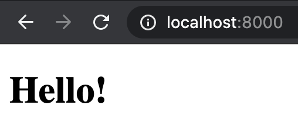
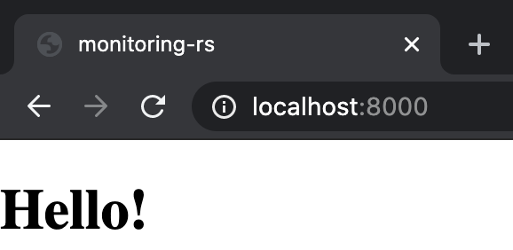
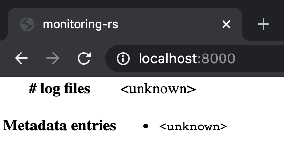
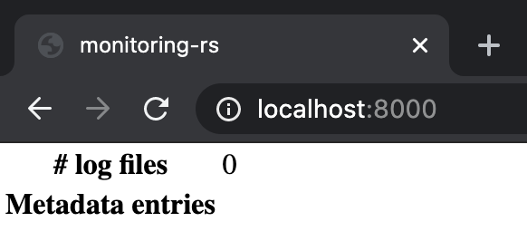
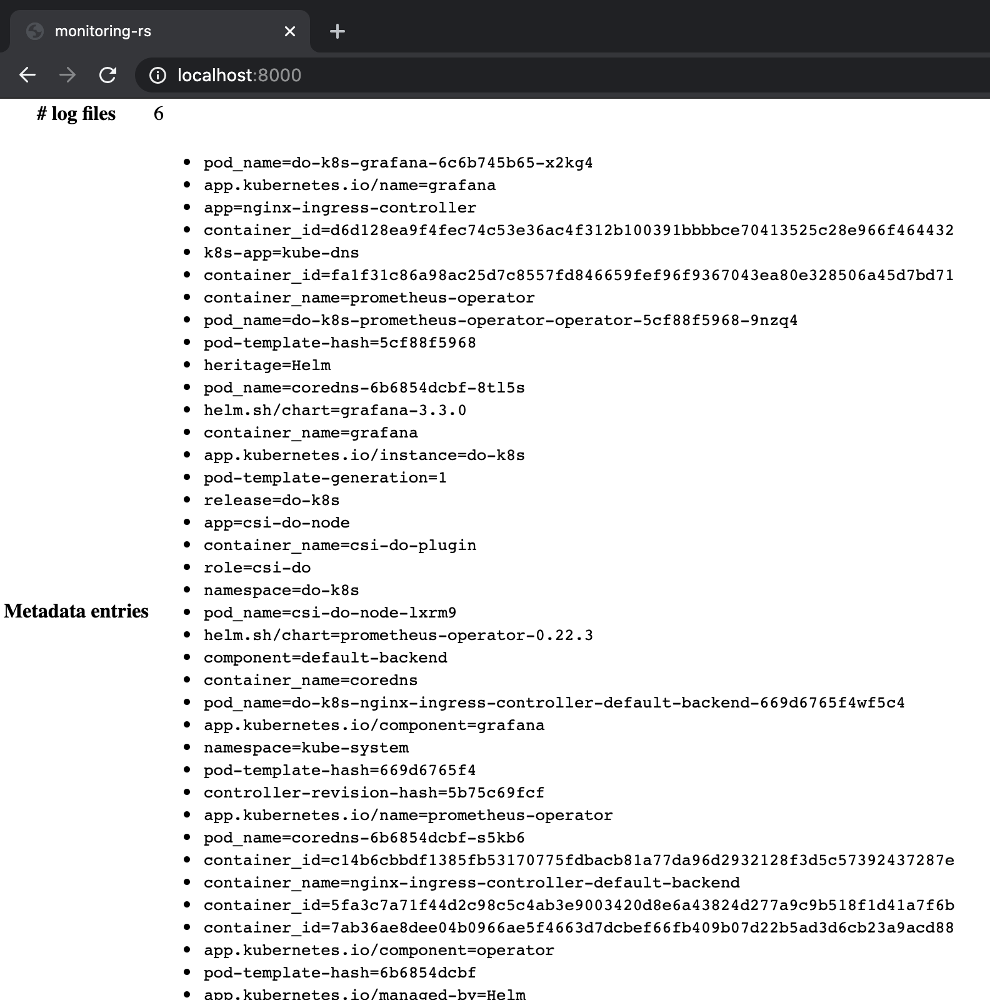
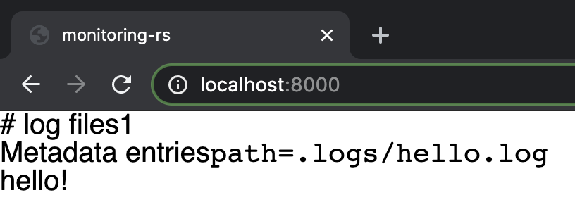
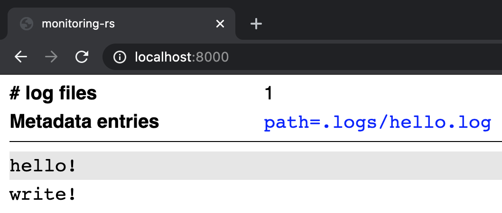
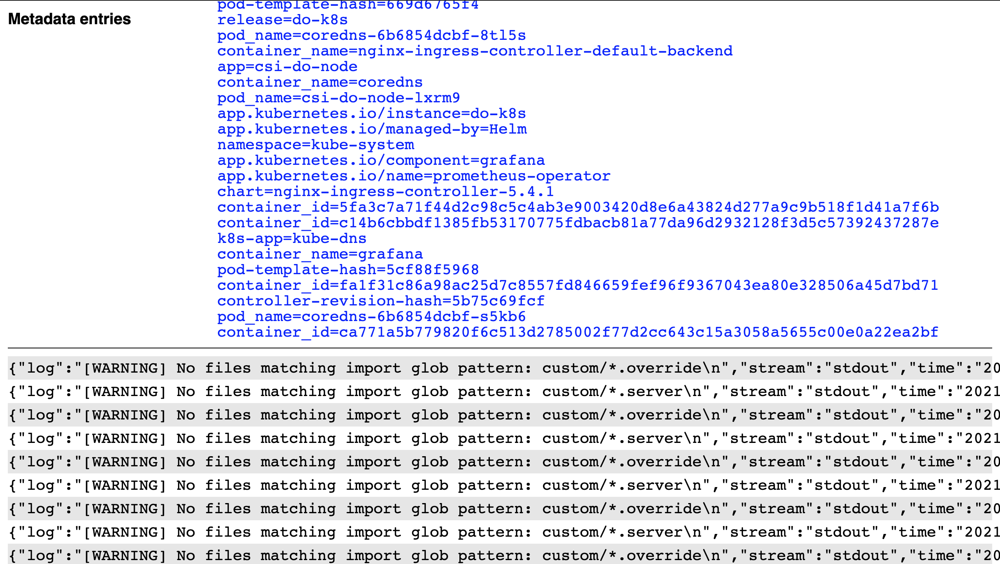

# Log collection part 14 (UI)

Let's try and throw up a basic web UI.
There are a bunch of ways we could do this, so let's work backwards.

## Serving a web page

Let's start off by creating a super simple `index.html` page and getting that to show up at `http://localhost:8000`:

```
$ mkdir -p frontend
```

```html
<!-- frontend/index.html -->
<!DOCTYPE html>
<html lang="en">
<head>
  <title>monitoring-rs</title>
</head>
<body>
  <h1>Hello!</h1>
</body>
</html>
```

```diff
--- a/src/api/mod.rs
+++ b/src/api/mod.rs
@@ -19,6 +19,7 @@ pub type Server = tide::Server<State>;
 /// Initialise an instance of the `monitoring-rs` HTTP API.
 pub fn server(database: State) -> Server {
     let mut app = tide::Server::with_state(database);
+    app.at("/").serve_file("../../frontend/index.html").unwrap();
     app.at("/status").get(get_status);
     app.at("/logs/:key/*value").get(read_logs);
     app
```

We also need to update Tide in order to get [`Route::serve_file`](https://docs.rs/tide/0.16.0/tide/struct.Body.html#method.from_file):

```diff
--- a/Cargo.toml
+++ b/Cargo.toml
@@ -17,7 +17,7 @@ repository = "https://github.com/connec/monitoring-rs"
 [dependencies]
 env_logger = "0.8.1"
 log = "0.4.11"
-tide = "0.15.0"
+tide = "0.16.0"
 async-std = { version = "1.7.0", features = ["attributes"] }
 blocking = "1.0.2"
 md5 = "0.7.0"
```

*And* update `tide-testing`:

```
$ cargo update -p tide-testing
```

Will it blend?

```
$ cargo run
...
Error: Os { code: 2, kind: NotFound, message: "No such file or directory" }
```

Apparently not.
Let's use `env!` to get the path of the project root directory:

```diff
--- a/src/api/mod.rs
+++ b/src/api/mod.rs
@@ -2,6 +2,7 @@

 //! Types and functions for initialising the `monitoring-rs` HTTP API.

+use std::path::Path;
 use std::sync::Arc;

 use async_std::sync::RwLock;
@@ -19,7 +20,9 @@ pub type Server = tide::Server<State>;
 /// Initialise an instance of the `monitoring-rs` HTTP API.
 pub fn server(database: State) -> Server {
     let mut app = tide::Server::with_state(database);
-    app.at("/").serve_file("../../frontend/index.html").unwrap();
+    app.at("/")
+        .serve_file(Path::new(env!("CARGO_MANIFEST_DIR")).join("frontend/index.html"))
+        .unwrap();
     app.at("/status").get(get_status);
     app.at("/logs/:key/*value").get(read_logs);
     app
```

And...

```
$ cargo run
...
Error: Os { code: 2, kind: NotFound, message: "No such file or directory" }
```

Huh.
Perhaps we're being idiots and misinterpreting our perfectly clear error messages, and this is actually about the `root_path`:

```
$ mkdir -p .logs
$ cargo run -- --root-path .logs
...
     Running `target/debug/monitoring-rs --root-path .logs`
```

Ah.
And now if we visit `http://localhost:8000` we get our result:



Wow, so beautiful.

## Embiggening

Of course, we could hardly claim to be diligent engineers without spending some thought on the overwhelming landscape of frontend technologies.
Whilst we could continue to just write and serve static HTML and JavaScript from `frontend/` we may anticipate a couple of challenges with that:

- Although very possible, building a front-end without a framework might lead us down a 'write-only' path, making it increasingly difficult to adapt or improve our front-end over time.
  If we try to keep things loosely coupled and modular, we may find ourselves writing yet another 'mini-React'.

- Whilst some understanding of HTML and JavaScript is necessary to build an efficient, functional, and well-presented UI, we could try to reduce our dependence on those languages by using a framework in another language, for example Rust!

- Both of the above apply again if the project is ever to be read or developed by another engineer.
  It would be easier and more beneficial to learn an existing mainstream framework.
  It would also be easier the fewer languages are involved.

If we do bring in a framework or another language, we also need to consider our development workflow, in particular dependency management and build tooling.
If we chose React and JavaScript, we would have access to hundreds of npm packages to save implementation effort on our part (things like time pickers and auto-completing search boxes).
We would still need to be able to manage those dependencies, meaning we would need npm as a build dependency.
We may also want a tool like webpack to give us dead-code elimination amongst other things.

Of course, there's another angle to this technology selection as well, which are the actual features and characeristics of the language or framework.
This is holy war territory, but suffice to say that if you think JavaScript is an appropriate language for writing reliable user interfaces you're a dirty infidel and should be burned at the stake. Haha, but really, we're writing our back-end in Rust and benefitting from the compile-time safety and (relative) correctness – no 'null-pointer exceptions' or `TypeError`s so far!
It seems cruel to ourselves to descend back into the primordial muck of JavaScript.

There are a few libraries for writing web applications in Rust, including [Seed](https://seed-rs.org/) and [yew](https://yew.rs/).
However, these libraries, as well as the general Rust frontend/WASM landscape, are very new and may subject us to a lot of churn.
I don't know about you, but I think we'll have our work cut out with our functional requirements without bringing in a whole new world of possible maintenance hazards and environmental gotchas.

So, we should pick something boring: [Elm](https://elm-lang.org/).
Elm is a small and comparatively stable language that offers similar type-system features to Rust (both take inspiration from OCaml), including `Option<T>` instead of `null` (spelled `Maybe T` in Elm) and `Result<T, E>` instead of exceptions (spelled `Result E T` in Elm).
Elm also goes further in some ways, or sheds some features depending on your perspective:

- Everything is immutable.
  There's no `let mut foo` or `&mut T` – all values are immutable.
- Thanks to the above, there's no 'borrowing' or associated features (`Box`, `Arc`, etc.).
  Functionally, all values are immutable references.
- There's a more firm seperation between computation and data – there's no 'object orientation', no classes, no traits, no ineritance.
  Elm's high-level constructs are modules, functions, records, and enums (also called "custom types").
- There are no user-defined generics.
  Elm has [constrained type variables](https://guide.elm-lang.org/types/reading_types.html#constrained-type-variables) that allow limited polymorphism for operators, but nothing more advanced than that.
  Typically-generic functions such as `map` are implemented specifically for each type, e.g. `Maybe.map`, `List.map`, and so on.

You might think that Elm seems less boring than JavaScript, but that can only be if you're thinking in a very 'write-only' way.
For maintaining, operating, and debugging a web application, Elm will be more boring.

### `elm init`

Now that I've convinced you, let's create an Elm application in our `frontend` directory (see [Install Elm](https://guide.elm-lang.org/install/elm.html) for installing the `elm` command).

```
$ rm -r frontend
$ mkdir frontend
$ cd frontend
$ elm init
Hello! Elm projects always start with an elm.json file. I can create them!

Now you may be wondering, what will be in this file? How do I add Elm files to
my project? How do I see it in the browser? How will my code grow? Do I need
more directories? What about tests? Etc.

Check out <https://elm-lang.org/0.19.1/init> for all the answers!

Knowing all that, would you like me to create an elm.json file now? [Y/n]:
Okay, I created it. Now read that link!

$ cat elm.json
{
    "type": "application",
    "source-directories": [
        "src"
    ],
    "elm-version": "0.19.1",
    "dependencies": {
        "direct": {
            "elm/browser": "1.0.2",
            "elm/core": "1.0.5",
            "elm/html": "1.0.0"
        },
        "indirect": {
            "elm/json": "1.1.3",
            "elm/time": "1.0.0",
            "elm/url": "1.0.0",
            "elm/virtual-dom": "1.0.2"
        }
    },
    "test-dependencies": {
        "direct": {},
        "indirect": {}
    }
}
```

Pretty straightforward.
Let's also create a skeleton `Main.elm` with the minimum definitions:

```elm
-- frontend/src/Main.elm


module Main exposing (main)

import Browser
import Browser.Navigation as Navigation
import Html
import Url exposing (Url)


main : Program Flags Model Msg
main =
    Browser.application
        { init = init
        , onUrlChange = always ()
        , onUrlRequest = always ()
        , subscriptions = always Sub.none
        , update = update
        , view = view
        }


type alias Flags =
    ()


type alias Model =
    ()


type alias Msg =
    ()


init : Flags -> Url -> Navigation.Key -> ( Model, Cmd Msg )
init flags url key =
    ( (), Cmd.none )


update : Msg -> Model -> ( Model, Cmd Msg )
update msg model =
    ( model, Cmd.none )


view : Model -> Browser.Document Msg
view model =
    { title = "monitoring-rs"
    , body = [ Html.h1 [] [ Html.text "Hello!" ] ]
    }
```

The formatting might not be to your taste, but thankfully Elm, like Rust, has a de-facto standard formatter, [`elm-format`](https://github.com/avh4/elm-format), so you don't have to think about it.
It's hopefully reasonably clear what's going on in the file so far:

- We declare a module, `Main`, and expose the `main` value.

- The `main` value is a [`Program`](https://package.elm-lang.org/packages/elm/core/latest/Platform#Program), which is the built in type representing an Elm program.
  This is totally opaque to us, but the Elm runtime knows how to orchestrate `Program` values.

- We use [`Browser.application`](https://package.elm-lang.org/packages/elm/browser/latest/Browser#application) to create a `Program`.
  The [`Browser`](https://package.elm-lang.org/packages/elm/browser/latest/) package has (at time of writing) four different `Program` constructors: [`sandbox`](https://package.elm-lang.org/packages/elm/browser/latest/Browser#sandbox), [`element`](https://package.elm-lang.org/packages/elm/browser/latest/Browser#element), [`document`](https://package.elm-lang.org/packages/elm/browser/latest/Browser#document), and [`application`](https://package.elm-lang.org/packages/elm/browser/latest/Browser#application).
  These constructors offer progressively more control over a web page, with `application` allowing to react to runtime and navigation events with `subscriptions`, `onUrlRequest`, and `onUrlChange`.
  The `init`, `update`, and `view` parameters define the core logic of the application:

  - `init` creates our initial `Model` and runtime commands (`Cmd`), based on application configuration (`Flags`) and a `Url` ([`Navigation.Key`](https://package.elm-lang.org/packages/elm/browser/latest/Browser-Navigation#Key) can be thought of as a handle for navigation control that's required to use navigation functions).
  - `update` takes a `Msg` to process and the current `Model`, and produces a new `Model` and `Cmd`s.
  - `view` takes the current `Model` and computes a `Browser.Document`.

- We've used type aliases for `Flags`, `Model`, and `Msg` to keep them in-sync across signatures as we update their definitions.
  They are all aliases for the empty tuple type `()`, which has a single value (the empty tuple, `()`).
  This is the same as Rust's `()`, but you'll see it less often since Elm has no side-effects, and so a function returning `()` is fairly useless except as a placeholder, like ours.

- `init` is constructing an initial `()` model and no-op runtime command (`Cmd.none`).

- `update` is returning the current model and no-op runtime command.

- `view` is returning a document matching our previous hand-coded `index.html` – the title is "monitoring-rs" and the body contains an `h1` with the text "Hello!".
  Elm programs describe their output using a virtual DOM representation, the [`Html`](https://package.elm-lang.org/packages/elm/html/latest/Html#Html) type.
  Like `Program`, `Html` is totally opaque to us, but the Elm runtime knows how to efficiently update the browser's DOM to match the `Html` structures we generate in our application.
  The [`Html`](https://package.elm-lang.org/packages/elm/html/latest/Html) module has functions for most common HTML tags, as well as [`Html.node`](https://package.elm-lang.org/packages/elm/html/latest/Html#node) as an 'escape hatch' for arbitrary HTML tags.

We can compile an `index.html` directly from our `Main.elm` using `elm make`:

```
$ elm make src/Main.elm
You are trying to import a `Url` module:

9| import Url exposing (Url)
          ^^^
I checked the "dependencies" and "source-directories" listed in your elm.json,
but I cannot find it! Maybe it is a typo for one of these names?

    Set
    Array
    Dict
    Main

Hint: Maybe you want the `Url` module defined in the elm/url package? Running
elm install elm/url should make it available!
```

Like Rust, Elm's has invested a lot in its compiler error messages.
The last suggestion is exactly what we want in this case:

```
$ elm install elm/url
I found it in your elm.json file, but in the "indirect" dependencies.
Should I move it into "direct" dependencies for more general use? [Y/n]:
Success!

$ elm make src/Main.elm
Success! Compiled 1 module.

    Main ───> index.html

$ head -n20 index.html
<!DOCTYPE HTML>
<html>
<head>
  <meta charset="UTF-8">
  <title>Main</title>
  <style>body { padding: 0; margin: 0; }</style>
</head>

<body>

<pre id="elm"></pre>

<script>
try {
(function(scope){
'use strict';

function F(arity, fun, wrapper) {
  wrapper.a = arity;
  wrapper.f = fun;

$ wc -l index.html
    5222 index.html
```

That's quite a lot of HTML and JavaScript for a more-or-less empty application, but no doubt comparable to the default boilerplate of other frontend frameworks.
At any rate, that should be enough for us to see our frontend:

```
$ cargo run -- --root-path .logs/
```



Wow, still beautiful.

### `make frontend`

Rather than having to `cd frontend && elm make src/Main.elm` every time we want to build our frontend, let's add a `make` task:

```diff
--- a/Makefile
+++ b/Makefile
@@ -1,5 +1,5 @@
 # Makefile
-.PHONY: build-monitoring monitoring writer inspect rotate down reset push
+.PHONY: build-monitoring monitoring writer inspect rotate down reset push frontend

 DOCKER_IMAGE := <registry>/monitoring-rs:latest

@@ -54,3 +54,6 @@ kubecleanup:

 deploy: push
  @kubectl apply --namespace monitoring-rs -f deployment/kubernetes.yaml
+
+frontend:
+ @cd frontend && elm make src/Main.elm
```

We should also get git to ignore Elm's compilation artifacts:

```
# frontend/.gitignore
/elm-stuff
/index.html
```

We should also set up auto-formatting in our editor of choice.
The `elm-format` README has an [Editor Integration table](https://github.com/avh4/elm-format#editor-integration) where you can hopefully find one for your editor.

## Viewing status

Let's start off by creating a UI for the `/status` endpoint.
As a reminder, the `/status` API returns a JSON object like the following:

```json
{
  "files_len": 12,
  "index_keys": [
    "app=cainjector",
    "app.kubernetes.io/name=grafana",
    "container_name=nginx-ingress-controller-controller"/*,
    ... */
  ]
}
```

Let's try and show these in a table like:

- **\# log files:** 12
- **Metadata entries:**
  - `app=cainjector`
  - `app.kubernetes.io/name=grafana`
  - `container_name=nginx-ingress-controller-controller`
  - ...

### Basic structure

Let's start by creating the table structure:

```diff
--- a/frontend/src/Main.elm
+++ b/frontend/src/Main.elm
@@ -5,7 +5,7 @@ module Main exposing (main)

 import Browser
 import Browser.Navigation as Navigation
-import Html
+import Html exposing (Html)
 import Url exposing (Url)


@@ -46,5 +46,22 @@ update msg model =
 view : Model -> Browser.Document Msg
 view model =
     { title = "monitoring-rs"
-    , body = [ Html.h1 [] [ Html.text "Hello!" ] ]
+    , body = [ viewStatus ]
     }
+
+
+viewStatus : Html Msg
+viewStatus =
+    Html.table []
+        [ Html.tr []
+            [ Html.th [] [ Html.text "# log files" ]
+            , Html.td [] [ Html.text "<unknown>" ]
+            ]
+        , Html.tr []
+            [ Html.th [] [ Html.text "Metadata entries" ]
+            , Html.td []
+                [ Html.ul []
+                    [ Html.li [] [ Html.code [] [ Html.text "<unknown>" ] ] ]
+                ]
+            ]
+        ]
```

We can view this new version in our browser by rebuilding the frontend, running `monitoring-rs`, and refreshing our browser window:

```
$ make frontend
Success!

    Main ───> index.html

$ cargo run -- --root-path .logs
```



This isn't a fantastic feedback loop – having to run `make frontend` after every change is a bit of a pain.
We can make this a bit easier for ourselves by keepin `cargo run -- --root-path .logs` running in one tab, and adding a `make watchfrontend` task.
There are dozens of tools we could use for file watching, but since we're already up and running with `cargo` let's use [`watchexec`](https://crates.io/crates/watchexec):

```
$ cargo install watchexec
...
   Installed package `watchexec v1.14.1` (executable `watchexec`)
```

```diff
--- a/Makefile
+++ b/Makefile
@@ -1,5 +1,5 @@
 # Makefile
-.PHONY: build-monitoring monitoring writer inspect rotate down reset push frontend
+.PHONY: build-monitoring monitoring writer inspect rotate down reset push frontend frontendwatch

 DOCKER_IMAGE := <registry>/monitoring-rs:latest

@@ -57,3 +57,6 @@ deploy: push

 frontend:
  @cd frontend && elm make src/Main.elm
+
+frontendwatch:
+ @watchexec --no-shell --exts elm --watch frontend/src make frontend
```

Now we can start `cargo run -- --root-path .logs` in one terminal tab, and `make frontendwatch` in another terminal tab.
Whenever we change a `*.elm` file in `frontend/src`, `watchexec` will re-run `make frontend`.
We can then simply refresh `http://localhost:8000` in our browser to see our new changes.

### `Status`

For the next frontend iteration, let's create a `Status` data structure and use a dummy instance to render our table:

```diff
--- a/frontend/src/Main.elm
+++ b/frontend/src/Main.elm
@@ -33,6 +33,12 @@ type alias Msg =
     ()


+type alias Status =
+    { filesLen : Int
+    , indexKeys : List String
+    }
+
+
 init : Flags -> Url -> Navigation.Key -> ( Model, Cmd Msg )
 init flags url key =
     ( (), Cmd.none )
@@ -45,23 +51,32 @@ update msg model =

 view : Model -> Browser.Document Msg
 view model =
+    let
+        status =
+            Status 123 [ "<unknown>" ]
+    in
     { title = "monitoring-rs"
-    , body = [ viewStatus ]
+    , body = [ viewStatus status ]
     }


-viewStatus : Html Msg
-viewStatus =
+viewStatus : Status -> Html Msg
+viewStatus { filesLen, indexKeys } =
+    let
+        viewList list =
+            List.map viewListItem list
+
+        viewListItem text =
+            Html.li [] [ Html.code [] [ Html.text text ] ]
+    in
     Html.table []
         [ Html.tr []
             [ Html.th [] [ Html.text "# log files" ]
-            , Html.td [] [ Html.text "<unknown>" ]
+            , Html.td [] [ Html.text <| String.fromInt filesLen ]
             ]
         , Html.tr []
             [ Html.th [] [ Html.text "Metadata entries" ]
             , Html.td []
-                [ Html.ul []
-                    [ Html.li [] [ Html.code [] [ Html.text "<unknown>" ] ] ]
-                ]
+                [ Html.ul [] <| viewList indexKeys ]
             ]
         ]
```

We've introduced a `Status` type alias for a record containing `filesLen: Int` and `indexKeys: List String`.
We've also updated `viewStatus` to take a `Status` record as an argument and use those fields to render the data in the table.
Finally, we're constructing a dummy `Status` record in `view` and passing that to `viewStatus`.

The interesting Elm things here are the use of `let ... in ...` for defining local variables and the default record constructor that's generated for record type aliases.
Note that `let ... in ...` is itself just an expression that could appear anywhere in Elm code to create local variables, principally similar to `{ let ... ; ... }` in Rust.
The default constructor is kinda similar to the constructors for tuple-variants in Rust, e.g.

```rust
struct Foo(u32);

fn foos() -> Vec<Foo> {
    vec![1, 2, 3].into_iter().map(Foo).collect()
}
```

Is roughly equivalent to:

```elm
type alias Foo =
    { f0: Int
    }


foos : List Foo
foos =
    List.map Foo [1, 2, 3]
```

### `elm/json`

Elm has standard library support for JSON (de)serialization in `elm/json`.
Like `elm/url`, this is currently an 'indirect dependency', and we need to promote it to a direct dependency to use it which we can do with `elm add`:

```
$ (cd frontend && elm install elm/json)
I found it in your elm.json file, but in the "indirect" dependencies.
Should I move it into "direct" dependencies for more general use? [Y/n]:
Success!
```

Like Rust, Elm has no runtime reflection to magically generate (de)serialization logic.
Sadly, unlike Rust, Elm has no equivalent to procedural macros to save us from the boilerplate of writing (de)serializers.
Thankfully they are quite easy to write, and having fully-typed JSON translation is worth it.

```diff
--- a/frontend/src/Main.elm
+++ b/frontend/src/Main.elm
@@ -6,6 +6,8 @@ module Main exposing (main)
 import Browser
 import Browser.Navigation as Navigation
 import Html exposing (Html)
+import Json.Decode as D
+import Json.Encode as E
 import Url exposing (Url)


@@ -39,6 +41,21 @@ type alias Status =
     }


+statusDecoder : D.Decoder Status
+statusDecoder =
+    D.map2 Status
+        (D.field "files_len" D.int)
+        (D.field "index_keys" <| D.list D.string)
+
+
+encodeStatus : Status -> E.Value
+encodeStatus { filesLen, indexKeys } =
+    E.object
+        [ ( "files_len", E.int filesLen )
+        , ( "index_keys", E.list E.string indexKeys )
+        ]
+
+
 init : Flags -> Url -> Navigation.Key -> ( Model, Cmd Msg )
 init flags url key =
     ( (), Cmd.none )
```

In future we could explore generating type aliases and/or decoders from our Rust types, but for now we will type them out by hand like true code artisans.

### `elm/http`

Elm also has standard library support for making HTTP requests, perhaps unsurprisingly in `elm/http`.
Again, we can install this trivially using `elm install`:

```
$ (cd frontend && elm install elm/http)
Here is my plan:

  Add:
    elm/bytes    1.0.8
    elm/file     1.0.5
    elm/http     2.0.0

Would you like me to update your elm.json accordingly? [Y/n]:
Success!
```

The simplest entrypoint to the `elm/http` library is [`Http.get`](https://package.elm-lang.org/packages/elm/http/latest/Http#get):

```elm
get :
    { url : String
    , expect : Expect msg
    }
    -> Cmd msg
```

`Http.get` takes a record with a `String` url and an `Expect msg`, whatever that is, and returns a `Cmd msg`, which we've previously referred to as a "runtime command".
If we follow the link to [`Expect`](https://package.elm-lang.org/packages/elm/http/latest/Http#Expect) in the docs we see it's described as "logic for interpreting a response body", and is following in the documentation by various `expect*` functions that each return `Expect msg`.

[`expectJson`](https://package.elm-lang.org/packages/elm/http/latest/Http#expectJson) looks pretty relevant:

> ```elm
> expectJson : (Result Error a -> msg) -> Decoder a -> Expect msg
> ```
>
> Expect the response body to be JSON.
> ...
> If the JSON decoder fails, you get a BadBody error that tries to explain what went wrong.

`Http.expectJson` takes two arguments.
The first is a function taking `Result Error a` (for some type `a`) and returning `msg` (for some type `msg`).
The second is a `Json.Decode.Decoder a` (for some type `a`).
We can 'join up' the type variables to get a reasonable idea of what will happen: return 'logic for interpreting a response body' as a JSON response that can be deserialized to `a`, and generate an application message `msg` from the result.
`Http.get`, given that `Expect msg`, would then construct a runtime command (`Cmd`) to perform the HTTP request and execute the response handling logic.
When the Elm runtime gets our `Cmd`, it will send the constructed `msg` back to us via `update`.

We can trivially plumb this in with our current `Msg` type to perform an HTTP request and effectively throw away the result:

```diff
--- a/frontend/src/Main.elm
+++ b/frontend/src/Main.elm
@@ -6,6 +6,7 @@ module Main exposing (main)
 import Browser
 import Browser.Navigation as Navigation
 import Html exposing (Html)
+import Http
 import Json.Decode as D
 import Json.Encode as E
 import Url exposing (Url)
@@ -58,7 +59,12 @@ encodeStatus { filesLen, indexKeys } =

 init : Flags -> Url -> Navigation.Key -> ( Model, Cmd Msg )
 init flags url key =
-    ( (), Cmd.none )
+    ( ()
+    , Http.get
+        { url = "http://localhost:8000/status"
+        , expect = Http.expectJson (always ()) statusDecoder
+        }
+    )


 update : Msg -> Model -> ( Model, Cmd Msg )
```

If we reload our browser and open the browser's devtools to inspect network requests we see that, indeed, we now send an HTTP request to `http://localhost:8000/status` when the page loads.

![Network requests in Chrome showing the details of a `status` request returning `{"files_len":0,"index_keys":[]}`.](../media/15-log-collection-part-14-ui/hello-http.png)

Now we need to get that response into our application.
`Http.expectJson` wants a `Result Error a -> msg` function, and we know that in this situation we want `Result Error Status -> Msg`.
We're currently using `always ()`, which is a function that takes a single argument and 'always' returns `()`, no matter the input.
Let's change our `Msg` type to an enum ('custom type'), with a `StatusResponse` variant that contains a `Result Error Status`:

```diff
--- a/frontend/src/Main.elm
+++ b/frontend/src/Main.elm
@@ -32,8 +32,8 @@ type alias Model =
     ()


-type alias Msg =
-    ()
+type Msg
+    = StatusResponse (Result Http.Error Status)


 type alias Status =
```

We of course now get some compiler errors:

```
Detected problems in 1 module.
-- TYPE MISMATCH -------------------------------------------------- src/Main.elm

The 1st argument to `application` is not what I expect:

17|     Browser.application
18|>        { init = init
19|>        , onUrlChange = always ()
20|>        , onUrlRequest = always ()
21|>        , subscriptions = always Sub.none
22|>        , update = update
23|>        , view = view
24|>        }

This argument is a record of type:

    { init : Flags -> Url -> Navigation.Key -> ( Model, Cmd Msg )
    , onUrlChange : Url -> ()
    , onUrlRequest : Browser.UrlRequest -> ()
    , subscriptions : Model -> Sub Msg
    , update : Msg -> Model -> ( Model, Cmd Msg )
    , view : Model -> Browser.Document Msg
    }

But `application` needs the 1st argument to be:

    { init : Flags -> Url -> Navigation.Key -> ( Model, Cmd Msg )
    , onUrlChange : Url -> Msg
    , onUrlRequest : Browser.UrlRequest -> Msg
    , subscriptions : Model -> Sub Msg
    , update : Msg -> Model -> ( Model, Cmd Msg )
    , view : Model -> Browser.Document Msg
    }

-- TYPE MISMATCH -------------------------------------------------- src/Main.elm

Something is off with the body of the `init` definition:

62|>    ( ()
63|>    , Http.get
64|>        { url = "http://localhost:8000/status"
65|>        , expect = Http.expectJson (always ()) statusDecoder
66|>        }
67|>    )

The body is a tuple of type:

    ( (), Cmd () )

But the type annotation on `init` says it should be:

    ( Model, Cmd Msg )
```

Of course, we've been returning `()` for `msg` which is no longer valid.
The fix for the 2nd `TYPE MISMATCH` is obvious – we can use our new `Msg` variant, exactly as we wanted:

```diff
--- a/frontend/src/Main.elm
+++ b/frontend/src/Main.elm
@@ -62,7 +62,7 @@ init flags url key =
     ( ()
     , Http.get
         { url = "http://localhost:8000/status"
-        , expect = Http.expectJson (always ()) statusDecoder
+        , expect = Http.expectJson StatusResponse statusDecoder
         }
     )

```

Now we have to think about `onUrlChange` (and `onUrlRequest`).
We don't really want to respond to these events yet, so we could deal with this in one of two ways:

- Make `Msg` an `Option InnerMsg`, allowing us to use `Nothing` whenever we need a `Msg`.
- Add a 'no-op' variant to `Msg`.

Whilst the first option has a nice conceptual clarity, it would make working with the `msg`s quite annoying (there would be a lot of `Just << Variant`).
So let's go ahead an inroduce a `NoOp` variant and use that instead:

```diff
--- a/frontend/src/Main.elm
+++ b/frontend/src/Main.elm
@@ -16,8 +16,8 @@ main : Program Flags Model Msg
 main =
     Browser.application
         { init = init
-        , onUrlChange = always ()
-        , onUrlRequest = always ()
+        , onUrlChange = always NoOp
+        , onUrlRequest = always NoOp
         , subscriptions = always Sub.none
         , update = update
         , view = view
@@ -33,7 +33,8 @@ type alias Model =


 type Msg
-    = StatusResponse (Result Http.Error Status)
+    = NoOp
+    | StatusResponse (Result Http.Error Status)


 type alias Status =
```

And we're compiling again.
Of course, we're still *ignoring* the generated message.
To handle it, we need to update `update`:

```diff
--- a/frontend/src/Main.elm
+++ b/frontend/src/Main.elm
@@ -70,7 +70,13 @@ init flags url key =

 update : Msg -> Model -> ( Model, Cmd Msg )
 update msg model =
-    ( model, Cmd.none )
+    case msg of
+        NoOp ->
+            ( model, Cmd.none )
+
+        StatusResponse statusResponse ->
+            -- what do?
+            ( model, Cmd.none )


 view : Model -> Browser.Document Msg
```

Of course, there's no actually anything we can do with `statusResponse` when our model is just `()`.
Let's solve this by making `Model` a record alias with a `statusResponse: Result Http.Error Status` field:

```diff
--- a/frontend/src/Main.elm
+++ b/frontend/src/Main.elm
@@ -29,7 +29,8 @@ type alias Flags =


 type alias Model =
-    ()
+    { statusResponse : Result Http.Error Status
+    }


 type Msg
@@ -75,8 +76,7 @@ update msg model =
             ( model, Cmd.none )

         StatusResponse statusResponse ->
-            -- what do?
-            ( model, Cmd.none )
+            ( { model | statusResponse = statusResponse }, Cmd.none )


 view : Model -> Browser.Document Msg
```


Now we're back to getting compilation errors:

```
-- TYPE MISMATCH -------------------------------------------------- src/Main.elm

Something is off with the body of the `init` definition:

64|>    ( ()
65|>    , Http.get
66|>        { url = "http://localhost:8000/status"
67|>        , expect = Http.expectJson StatusResponse statusDecoder
68|>        }
69|>    )

The body is a tuple of type:

    ( (), Cmd Msg )

But the type annotation on `init` says it should be:

    ( Model, Cmd Msg )
```

Of course – we need to update `init` to return our new `Model` type.
But what should we initialize it to?
We could construct a 'default' `Ok Status`, or `Err Http.Error`, but that might not be great from a user experience perspective since our `view` would presumably show the default data or HTTP error until the request completed.
We could add a flag to the model indicating whether or not the response was completed, and use that to change the UI behaviour, but we then have to worry about keeping that in sync depending on whether or not `statusResponse` is the default value.

A better model for this would be `Maybe (Result Http.Error Status)`.
This let's us represent three states: `Nothing` (no response), `Just (Err _)` (error response), and `Just (Ok _)` (sucessful response).
An even more nuanced model could use a custom type that can additionally discriminate between 'unsent' and 'sent' states, if required by the UI.
For now let's just use `Maybe`:

```diff
--- a/frontend/src/Main.elm
+++ b/frontend/src/Main.elm
@@ -29,7 +29,7 @@ type alias Flags =


 type alias Model =
-    { statusResponse : Result Http.Error Status
+    { statusResponse : Maybe (Result Http.Error Status)
     }


@@ -61,7 +61,7 @@ encodeStatus { filesLen, indexKeys } =

 init : Flags -> Url -> Navigation.Key -> ( Model, Cmd Msg )
 init flags url key =
-    ( ()
+    ( Model Nothing
     , Http.get
         { url = "http://localhost:8000/status"
         , expect = Http.expectJson StatusResponse statusDecoder
@@ -76,7 +76,7 @@ update msg model =
             ( model, Cmd.none )

         StatusResponse statusResponse ->
-            ( { model | statusResponse = statusResponse }, Cmd.none )
+            ( { model | statusResponse = Just statusResponse }, Cmd.none )


 view : Model -> Browser.Document Msg
```

And we're compiling again.
Now all we need to do is update `view`:

```diff
--- a/frontend/src/Main.elm
+++ b/frontend/src/Main.elm
@@ -81,15 +81,24 @@ update msg model =

 view : Model -> Browser.Document Msg
 view model =
-    let
-        status =
-            Status 123 [ "<unknown>" ]
-    in
     { title = "monitoring-rs"
-    , body = [ viewStatus status ]
+    , body = [ viewStatusResponse model.statusResponse ]
     }


+viewStatusResponse : Maybe (Result Http.Error Status) -> Html Msg
+viewStatusResponse statusResponse =
+    case statusResponse of
+        Just (Ok status) ->
+            viewStatus status
+
+        Just (Err _) ->
+            Html.text "Something went wrong..."
+
+        Nothing ->
+            Html.text "Loading..."
+
+
 viewStatus : Status -> Html Msg
 viewStatus { filesLen, indexKeys } =
     let
```

We've introduced a new `viewStatusResponse` function where we check the three possible states of `responseStatus`.
Note that Elm's pattern matching is exhaustive just like Rust, so if we missed a state the compiler will let us know, e.g.

```
-- MISSING PATTERNS ----------------------------------------------- src/Main.elm

This `case` does not have branches for all possibilities:

91|>    case statusResponse of
92|>        Just (Ok status) ->
93|>            viewStatus status
94|>
95|>        Nothing ->
96|>            Html.text "Loading..."

Missing possibilities include:

    Just (Err _)

I would have to crash if I saw one of those. Add branches for them!

Hint: If you want to write the code for each branch later, use `Debug.todo` as a
placeholder. Read <https://elm-lang.org/0.19.1/missing-patterns> for more
guidance on this workflow.
```

And just like that we've done it!
If we refresh the browser we should see the data from our running monitor:



Not very interesting.
We can create a log file, though, and see the status update:

```
$ touch .logs/hello.log
$ echo hello! >> .logs/hello.log
```

Oops, we crashed our monitor:

```
thread 'blocking-1' panicked at 'called `Result::unwrap()` on an `Err` value: ["hello"]', /Users/chris/repos/monitoring-rs/src/log_collector/kubernetes.rs:88:60
note: run with `RUST_BACKTRACE=1` environment variable to display a backtrace
thread 'async-std/runtime' panicked at 'task has failed', /Users/chris/.cargo/registry/src/github.com-1ecc6299db9ec823/async-task-4.0.3/src/task.rs:368:45
thread 'main' panicked at 'task has failed', /Users/chris/.cargo/registry/src/github.com-1ecc6299db9ec823/async-task-4.0.3/src/task.rs:368:45
```

Of course, we're running the default Kubernetes collector.
Let's restart with `--log-collector Directory`:

```
$ cargo run -- --log-collector Directory --root-path .logs

# in another tab
$ echo hello! >> .logs/hello.log
```

And, wowie:


Truly incredible.

## Deployment

Before we look at the `/logs` endpoint, we should update our Docker image to include the frontend assets.
Indeed, if we `make monitoring` now we end up with:

```
$ make monitoring
...
monitoring_1  | [2021-02-08T17:25:04Z DEBUG monitoring_rs::log_collector::directory] Initialising watch on root path "/var/log/containers"
monitoring_1  | thread 'main' panicked at 'called `Result::unwrap()` on an `Err` value: Os { code: 2, kind: NotFound, message: "No such file or directory" }', src/api/mod.rs:25:10
monitoring_1  | note: run with `RUST_BACKTRACE=1` environment variable to display a backtrace
monitoring-rs_monitoring_1 exited with code 101
```

`src/api/mod.rs` is:

```rust
app.at("/")
    .serve_file(Path::new(env!("CARGO_MANIFEST_DIR")).join("frontend/index.html"))
    .unwrap();
```

Of course, we are not putting `frontend/index.html` into the image.
Also, `env!("CARGO_MANIFEST_DIR")` will be evaluated at compile time, so we need to match this with the build image environment.
The simplest way of doing this would be to `COPY` the file into `/build/frontend` on the runtime image:

```diff
--- a/.dockerignore
+++ b/.dockerignore
@@ -1,3 +1,4 @@
 *
+!frontend/index.html
 !src/*
 !Cargo.*
```

```diff
--- a/Dockerfile
+++ b/Dockerfile
@@ -30,4 +30,5 @@ RUN apk add --no-cache libgcc tini
 ENTRYPOINT ["/sbin/tini", "--"]
 CMD ["monitoring-rs"]

+COPY frontend/index.html /build/frontend/index.html
 COPY --from=builder /build/target/release/monitoring-rs /usr/local/bin
 ```

Now we can start our `monitoring` and `writer` services, and see the status as `http://localhost:8000`:

```
$ make down writer monitoring
...
monitoring_1  | [2021-02-08T17:41:34Z DEBUG monitoring_rs::log_collector::directory] Initialising watch on root path "/var/log/containers"
monitoring_1  | [2021-02-08T17:42:42Z DEBUG monitoring_rs::log_collector::directory] Create /var/log/containers/writer_fake_writer_abc123.log
monitoring_1  | [2021-02-08T17:42:42Z DEBUG monitoring_rs::log_collector::directory] Append /var/log/containers/writer_fake_writer_abc123.log
...
```


This should be enough for us to get the thing running in Kubernetes as well:

```
$ make deploy
...
serviceaccount/monitoring-rs unchanged
clusterrole.rbac.authorization.k8s.io/monitoring-rs unchanged
clusterrolebinding.rbac.authorization.k8s.io/monitoring-rs unchanged
deployment.apps/monitoring-rs unchanged

$ kubectl -n monitoring-rs delete pods -l app=monitoring-rs
pod "monitoring-rs-79b44fbb94-mmbc6" deleted

$ kubectl -n monitoring-rs get pods
NAME                             READY   STATUS    RESTARTS   AGE
monitoring-rs-79b44fbb94-bv4s4   1/1     Running   0          11s

$ kubectl -n monitoring-rs port-forward monitoring-rs-79b44fbb94-bv4s4 8000
Forwarding from 127.0.0.1:8000 -> 8000
Forwarding from [::1]:8000 -> 8000
```

Now if we open `http://localhost:8000` in our browser we'll get something like:



## Showing logs

Rather than implementing a pretty useless search box, let's for now just create links out of the metadata entries that, on click, will fetch log entries from the API:

```diff
--- a/frontend/src/Main.elm
+++ b/frontend/src/Main.elm
@@ -6,6 +6,8 @@ module Main exposing (main)
 import Browser
 import Browser.Navigation as Navigation
 import Html exposing (Html)
+import Html.Attributes as Attr
+import Html.Events as Events
 import Http
 import Json.Decode as D
 import Json.Encode as E
@@ -30,12 +32,15 @@ type alias Flags =

 type alias Model =
     { statusResponse : Maybe (Result Http.Error Status)
+    , logsResponse : Maybe (Result Http.Error Logs)
     }


 type Msg
     = NoOp
     | StatusResponse (Result Http.Error Status)
+    | GetLogs String String
+    | LogsResponse (Result Http.Error Logs)


 type alias Status =
@@ -59,9 +64,18 @@ encodeStatus { filesLen, indexKeys } =
         ]


+type alias Logs =
+    List String
+
+
+logsDecoder : D.Decoder Logs
+logsDecoder =
+    D.list D.string
+
+
 init : Flags -> Url -> Navigation.Key -> ( Model, Cmd Msg )
 init flags url key =
-    ( Model Nothing
+    ( Model Nothing Nothing
     , Http.get
         { url = "http://localhost:8000/status"
         , expect = Http.expectJson StatusResponse statusDecoder
@@ -78,11 +92,25 @@ update msg model =
         StatusResponse statusResponse ->
             ( { model | statusResponse = Just statusResponse }, Cmd.none )

+        GetLogs key value ->
+            ( { model | logsResponse = Nothing }
+            , Http.get
+                { url = "http://localhost:8000/logs/" ++ key ++ "/" ++ value
+                , expect = Http.expectJson LogsResponse logsDecoder
+                }
+            )
+
+        LogsResponse logsResponse ->
+            ( { model | logsResponse = Just logsResponse }, Cmd.none )
+

 view : Model -> Browser.Document Msg
 view model =
     { title = "monitoring-rs"
-    , body = [ viewStatusResponse model.statusResponse ]
+    , body =
+        [ viewStatusResponse model.statusResponse
+        , viewLogsResponse model.logsResponse
+        ]
     }


@@ -102,11 +130,31 @@ viewStatusResponse statusResponse =
 viewStatus : Status -> Html Msg
 viewStatus { filesLen, indexKeys } =
     let
-        viewList list =
-            List.map viewListItem list
-
-        viewListItem text =
-            Html.li [] [ Html.code [] [ Html.text text ] ]
+        viewIndexKeys =
+            List.map viewIndexKeysItem indexKeys
+
+        viewIndexKeysItem indexKey =
+            Html.li [] [ viewIndexKeyLink indexKey ]
+
+        viewIndexKeyLink indexKey =
+            let
+                maybeKeyValue =
+                    case String.split "=" indexKey of
+                        key :: value ->
+                            Just ( key, String.join "=" value )
+
+                        _ ->
+                            Nothing
+
+                content =
+                    Html.code [] [ Html.text indexKey ]
+            in
+            case maybeKeyValue of
+                Just ( key, value ) ->
+                    Html.a [ Attr.href "", Events.onClick <| GetLogs key value ] [ content ]
+
+                Nothing ->
+                    content
     in
     Html.table []
         [ Html.tr []
@@ -116,6 +164,23 @@ viewStatus { filesLen, indexKeys } =
         , Html.tr []
             [ Html.th [] [ Html.text "Metadata entries" ]
             , Html.td []
-                [ Html.ul [] <| viewList indexKeys ]
+                [ Html.ul [] <| viewIndexKeys ]
             ]
         ]
+
+
+viewLogsResponse : Maybe (Result Http.Error Logs) -> Html Msg
+viewLogsResponse logsResponse =
+    case logsResponse of
+        Just (Ok logs) ->
+            let
+                viewLog log =
+                    Html.li [] [ Html.text log ]
+            in
+            Html.ul [] <| List.map viewLog logs
+
+        Just (Err _) ->
+            Html.text "Something went wrong..."
+
+        Nothing ->
+            Html.text ""
```

We've updated `viewStatus` to add a link with an `Events.onClick` property (if the index key contains an `=`).
`Events.onClick msg` will cause the Elm runtime to add a click handler to the associated element that will send the `msg` to our `update` function.
We've added two new `Msg` variants, one to kick-off the request (`GetLog String String`) and one to handle the response (`LogsResponse`).
The request and response handling is almost identical to that for `Status`.
We've also added a type alias for `Logs` and a JSON decoder.

Finally, we've added `viewLogsResponse` which will simply create an unordered list of log items from the response.
With our monitor running locally, after rebuilding the front end we can now retrieve logs!


Let's shove that up to Kubernetes and make sure it does what we expect:

```
$ make push
latest: digest: sha256:e36d3e531c44a37f62eeacca5b110a8cc020883b2c6c754e224102cfdb5c5e55 size: 1157

$ kubectl -n monitoring-rs delete pods -l app=monitoring-rs
pod "monitoring-rs-79b44fbb94-bv4s4" deleted

$ kubectl -n monitoring-rs get pods
NAME                             READY   STATUS    RESTARTS   AGE
monitoring-rs-79b44fbb94-87hrc   1/1     Running   0          17s

$ kubectl -n monitoring-rs port-forward monitoring-rs-79b44fbb94-87hrc 8000
Forwarding from 127.0.0.1:8000 -> 8000
Forwarding from [::1]:8000 -> 8000
```


Incréable.

## Beautification

Our design is a bit pants right now, so let's bring some light styling to our UI.
As usual, there are dozens of ways we could do this, from writing raw CSS to adding inline styles to our Elm `Html` nodes.
There are also some Elm packages that offer alternative APIs for styling Elm applications, including:

- [`elm-css`](https://package.elm-lang.org/packages/rtfeldman/elm-css/latest/), which provides a wrapper around the `Html` module that includes styling information.
  Styling information can be added to element attributes using [`Html.Styled.Attributes.css`](https://package.elm-lang.org/packages/rtfeldman/elm-css/latest/Html-Styled-Attributes#css), and [`Html.Styled.toUnstyled`](https://package.elm-lang.org/packages/rtfeldman/elm-css/latest/Html-Styled#toUnstyled) can be used to convert to an `Html.Styled` node back to a regular `Html` node.
  Under the hood, this deduplicates common styles and generates a single `<style>` tag in the resulting document containing all the styles.

- [Elm UI](https://package.elm-lang.org/packages/mdgriffith/elm-ui/latest/), which describes itself as "a new language for layout and interface".
  This could be considered a 'reimagining' of DOM and CSS designed to work well with Elm.
  The API is similar to `elm/html`, but you build your views from [`Element`](https://package.elm-lang.org/packages/mdgriffith/elm-ui/latest/Element#Element) and convert the root to `Html` with [`Element.layout`](https://package.elm-lang.org/packages/mdgriffith/elm-ui/latest/Element#layout).
  Like `elm-css`, this will generate `<style>` tags in the document and tries to efficiently represent styles.

`elm-css` (or just directly using CSS) would let us speak the browser's language, and therefore allow us to express any styling arrangement for which we know the correct incantation.
Elm UI, on the other hand, gives us a chance to ignore the details of CSS and use a higher-level expression.

Let's take a gamble on Elm UI – since we are not too opinionated about the exact HTML and CSS that makes up our frontend, we shall hopefully not miss the ability to invoke raw CSS.
We can add it to our project using `elm install`:

```
$ (cd frontend && elm install mdgriffith/elm-ui)
Here is my plan:

  Add:
    mdgriffith/elm-ui    1.1.8

Would you like me to update your elm.json accordingly? [Y/n]:
Success!
```

Let's start by updating `view` to return `Element Msg` and whac-a-mole our way from there:

```diff
--- a/frontend/src/Main.elm
+++ b/frontend/src/Main.elm
@@ -5,6 +5,7 @@ module Main exposing (main)

 import Browser
 import Browser.Navigation as Navigation
+import Element exposing (Element)
 import Html exposing (Html)
 import Html.Attributes as Attr
 import Html.Events as Events
@@ -16,13 +17,17 @@ import Url exposing (Url)

 main : Program Flags Model Msg
 main =
+    let
+        layout document =
+            { title = document.title, body = [ Element.layout [] document.body ] }
+    in
     Browser.application
         { init = init
         , onUrlChange = always NoOp
         , onUrlRequest = always NoOp
         , subscriptions = always Sub.none
         , update = update
-        , view = view
+        , view = view >> layout
         }


@@ -104,7 +109,7 @@ update msg model =
             ( { model | logsResponse = Just logsResponse }, Cmd.none )


-view : Model -> Browser.Document Msg
+view : Model -> { title : String, body : Element Msg }
 view model =
     { title = "monitoring-rs"
     , body =
```

We've redefined `view` to return a `{ title: String, body: Element Msg }` record, and are converting that to a `Browser.Document` inside `main`.
This gives us a single compiler error:

```
-- TYPE MISMATCH -------------------------------------------------- src/Main.elm

Something is off with the body of the `view` definition:

114|>    { title = "monitoring-rs"
115|>    , body =
116|>        [ viewStatusResponse model.statusResponse
117|>        , viewLogsResponse model.logsResponse
118|>        ]
119|>    }

The body is a record of type:

    { body : List (Html Msg), title : String }

But the type annotation on `view` says it should be:

    { body : Element Msg, title : String }
```

So we need to decide how we want to layout the status and the logs.
The documentation quickly leads us to [`Element.row`](https://package.elm-lang.org/packages/mdgriffith/elm-ui/latest/Element#row) or [`Element.column`](https://package.elm-lang.org/packages/mdgriffith/elm-ui/latest/Element#column) for arranging multiple elements.
Let's stick with a columnal arrangement for now:

```diff
--- a/frontend/src/Main.elm
+++ b/frontend/src/Main.elm
@@ -113,9 +113,10 @@ view : Model -> { title : String, body : Element Msg }
 view model =
     { title = "monitoring-rs"
     , body =
-        [ viewStatusResponse model.statusResponse
-        , viewLogsResponse model.logsResponse
-        ]
+        Element.column []
+            [ viewStatusResponse model.statusResponse
+            , viewLogsResponse model.logsResponse
+            ]
     }


```

Now we get a new compiler error:

```
-- TYPE MISMATCH -------------------------------------------------- src/Main.elm

The 2nd argument to `column` is not what I expect:

116|         Element.column []
117|>            [ viewStatusResponse model.statusResponse
118|>            , viewLogsResponse model.logsResponse
119|>            ]

This argument is a list of type:

    List (Html Msg)

But `column` needs the 2nd argument to be:

    List (Element msg)

Hint: I always figure out the argument types from left to right. If an argument
is acceptable, I assume it is “correct” and move on. So the problem may actually
be in one of the previous arguments!
```

Indeed, so we have to update `viewStatusResponse` and `viewLogsResponse`.
We'll start by just updating the signature of `viewStatusResponse`:

```diff
--- a/frontend/src/Main.elm
+++ b/frontend/src/Main.elm
@@ -120,7 +120,7 @@ view model =
     }


-viewStatusResponse : Maybe (Result Http.Error Status) -> Html Msg
+viewStatusResponse : Maybe (Result Http.Error Status) -> Element Msg
 viewStatusResponse statusResponse =
     case statusResponse of
         Just (Ok status) ->
```

This gives us a predictable error for each branch of the `case`:

```
-- TYPE MISMATCH -------------------------------------------------- src/Main.elm

Something is off with the 3rd branch of this `case` expression:

133|             Html.text "Loading..."
                 ^^^^^^^^^^^^^^^^^^^^^^
This `text` call produces:

    Html msg

But the type annotation on `viewStatusResponse` says it should be:

    Element Msg

-- TYPE MISMATCH -------------------------------------------------- src/Main.elm

Something is off with the 2nd branch of this `case` expression:

130|             Html.text "Something went wrong..."
                 ^^^^^^^^^^^^^^^^^^^^^^^^^^^^^^^^^^^
This `text` call produces:

    Html msg

But the type annotation on `viewStatusResponse` says it should be:

    Element Msg

-- TYPE MISMATCH -------------------------------------------------- src/Main.elm

Something is off with the 1st branch of this `case` expression:

127|             viewStatus status
                 ^^^^^^^^^^^^^^^^^
This `viewStatus` call produces:

    Html Msg

But the type annotation on `viewStatusResponse` says it should be:

    Element Msg
```

We can fix these by updating the signature of `viewStatus` and using `Element.text` instead of `Html.text`:

```diff
--- a/frontend/src/Main.elm
+++ b/frontend/src/Main.elm
@@ -127,13 +127,13 @@ viewStatusResponse statusResponse =
             viewStatus status

         Just (Err _) ->
-            Html.text "Something went wrong..."
+            Element.text "Something went wrong..."

         Nothing ->
-            Html.text "Loading..."
+            Element.text "Loading..."


-viewStatus : Status -> Html Msg
+viewStatus : Status -> Element Msg
 viewStatus { filesLen, indexKeys } =
     let
         viewIndexKeys =
```

Now we get a compiler error from inside `viewStatus`:

```
-- TYPE MISMATCH -------------------------------------------------- src/Main.elm

Something is off with the body of the `viewStatus` definition:

165|>    Html.table []
166|>        [ Html.tr []
167|>            [ Html.th [] [ Html.text "# log files" ]
168|>            , Html.td [] [ Html.text <| String.fromInt filesLen ]
169|>            ]
170|>        , Html.tr []
171|>            [ Html.th [] [ Html.text "Metadata entries" ]
172|>            , Html.td []
173|>                [ Html.ul [] <| viewIndexKeys ]
174|>            ]
175|>        ]

This `table` call produces:

    Html Msg

But the type annotation on `viewStatus` says it should be:

    Element Msg
```

We have a chance to reconsider how we will lay out the status.
Let's stick with the vaguely tabular approach for now.
There is an [`Element.table`](https://package.elm-lang.org/packages/mdgriffith/elm-ui/latest/Element#table) function, but it's very reasonably tailored to creating tables from lists of records.
Let's instead swap:

- `Html.table` -> `Element.column`
- `Html.tr` -> `Element.row`
- `Html.td` -> *nothing* (remove it from the DOM)
- `Html.text` -> `Element.text`
- `Html.ul` -> `Element.column`

```diff
--- a/frontend/src/Main.elm
+++ b/frontend/src/Main.elm
@@ -162,15 +162,14 @@ viewStatus { filesLen, indexKeys } =
                 Nothing ->
                     content
     in
-    Html.table []
-        [ Html.tr []
-            [ Html.th [] [ Html.text "# log files" ]
-            , Html.td [] [ Html.text <| String.fromInt filesLen ]
+    Element.column []
+        [ Element.row []
+            [ Element.text "# log files"
+            , Element.text <| String.fromInt filesLen
             ]
-        , Html.tr []
-            [ Html.th [] [ Html.text "Metadata entries" ]
-            , Html.td []
-                [ Html.ul [] <| viewIndexKeys ]
+        , Element.row []
+            [ Element.text "Metadata entries"
+            , Element.column [] <| viewIndexKeys
             ]
         ]

```

Now we're onto the helper functions in `viewStatus`:

```
-- TYPE MISMATCH -------------------------------------------------- src/Main.elm

I cannot send this through the (<|) pipe:

172|             , Element.column [] <| viewIndexKeys
                                        ^^^^^^^^^^^^^
The argument is:

    List (Html Msg)

But (<|) is piping it to a function that expects:

    List (Element msg)
```

We can just remove `viewIndexKeyItem`, since `li` has no use in our `Element` structure:

```diff
--- a/frontend/src/Main.elm
+++ b/frontend/src/Main.elm
@@ -137,10 +137,7 @@ viewStatus : Status -> Element Msg
 viewStatus { filesLen, indexKeys } =
     let
         viewIndexKeys =
-            List.map viewIndexKeysItem indexKeys
-
-        viewIndexKeysItem indexKey =
-            Html.li [] [ viewIndexKeyLink indexKey ]
+            List.map viewIndexKeyLink indexKeys

         viewIndexKeyLink indexKey =
             let
```

For `viewIndexKeyLink` we need to deal with `Html.a` and `Html.code`.
For `Html.a` we can use [`Element.link`](https://package.elm-lang.org/packages/mdgriffith/elm-ui/latest/Element#link):

```diff
--- a/frontend/src/Main.elm
+++ b/frontend/src/Main.elm
@@ -6,9 +6,9 @@ module Main exposing (main)
 import Browser
 import Browser.Navigation as Navigation
 import Element exposing (Element)
+import Element.Events as Events
 import Html exposing (Html)
 import Html.Attributes as Attr
-import Html.Events as Events
 import Http
 import Json.Decode as D
 import Json.Encode as E
@@ -154,7 +154,11 @@ viewStatus { filesLen, indexKeys } =
             in
             case maybeKeyValue of
                 Just ( key, value ) ->
-                    Html.a [ Attr.href "", Events.onClick <| GetLogs key value ] [ content ]
+                    Element.link
+                        [ Events.onClick <| GetLogs key value ]
+                        { url = ""
+                        , label = content
+                        }

                 Nothing ->
                     content
```

This leaves us with two compiler errors related to `content`:

```
-- TYPE MISMATCH -------------------------------------------------- src/Main.elm

The 2nd branch of this `case` does not match all the previous branches:

155|             case maybeKeyValue of
156|                 Just ( key, value ) ->
157|                     Element.link
158|                         [ Events.onClick <| GetLogs key value ]
159|                         { url = ""
160|                         , label = content
161|                         }
162|
163|                 Nothing ->
164|                     content
                         ^^^^^^^
This `content` value is a:

    Html msg

But all the previous branches result in:

    Element Msg

Hint: All branches in a `case` must produce the same type of values. This way,
no matter which branch we take, the result is always a consistent shape. Read
<https://elm-lang.org/0.19.1/custom-types> to learn how to “mix” types.

-- TYPE MISMATCH -------------------------------------------------- src/Main.elm

The 2nd argument to `link` is not what I expect:

157|                     Element.link
158|                         [ Events.onClick <| GetLogs key value ]
159|>                        { url = ""
160|>                        , label = content
161|>                        }

This argument is a record of type:

    { label : Html msg, url : String }

But `link` needs the 2nd argument to be:

    { label : Element Msg, url : String }

Hint: I always figure out the argument types from left to right. If an argument
is acceptable, I assume it is “correct” and move on. So the problem may actually
be in one of the previous arguments!
```

Now we need to deal with `Html.code`.
Let's go for `Element.el` with a monospace font:

```diff
--- a/frontend/src/Main.elm
+++ b/frontend/src/Main.elm
@@ -7,6 +7,7 @@ import Browser
 import Browser.Navigation as Navigation
 import Element exposing (Element)
 import Element.Events as Events
+import Element.Font as Font
 import Html exposing (Html)
 import Html.Attributes as Attr
 import Http
@@ -150,7 +151,9 @@ viewStatus { filesLen, indexKeys } =
                             Nothing

                 content =
-                    Html.code [] [ Html.text indexKey ]
+                    Element.el
+                        [ Font.family [ Font.monospace ] ]
+                        (Element.text indexKey)
             in
             case maybeKeyValue of
                 Just ( key, value ) ->
```

Now we're down to errors for `viewLogsResponse`.
This is easy enough to update based on changes we've made before (`Html.ul` -> `Element.ul`, `Html.text` -> `Element.text`, remove `Html.li`):

```diff
--- a/frontend/src/Main.elm
+++ b/frontend/src/Main.elm
@@ -178,18 +178,14 @@ viewStatus { filesLen, indexKeys } =
         ]


-viewLogsResponse : Maybe (Result Http.Error Logs) -> Html Msg
+viewLogsResponse : Maybe (Result Http.Error Logs) -> Element Msg
 viewLogsResponse logsResponse =
     case logsResponse of
         Just (Ok logs) ->
-            let
-                viewLog log =
-                    Html.li [] [ Html.text log ]
-            in
-            Html.ul [] <| List.map viewLog logs
+            Element.column [] <| List.map Element.text logs

         Just (Err _) ->
-            Html.text "Something went wrong..."
+            Element.text "Something went wrong..."

         Nothing ->
-            Html.text ""
+            Element.text ""
```

And it compiles 🎉
But what does it look like?



Well... the content's there.
Let's try being a bit more explicit about how we expect things to be sized.
We'll start with a shotgun blast of `width`s and `spacing`s:

```diff
--- a/frontend/src/Main.elm
+++ b/frontend/src/Main.elm
@@ -20,7 +20,9 @@ main : Program Flags Model Msg
 main =
     let
         layout document =
-            { title = document.title, body = [ Element.layout [] document.body ] }
+            { title = document.title
+            , body = [ Element.layout [ Element.padding 10 ] document.body ]
+            }
     in
     Browser.application
         { init = init
@@ -114,7 +116,7 @@ view : Model -> { title : String, body : Element Msg }
 view model =
     { title = "monitoring-rs"
     , body =
-        Element.column []
+        Element.column [ Element.width Element.fill, Element.spacing 10 ]
             [ viewStatusResponse model.statusResponse
             , viewLogsResponse model.logsResponse
             ]
@@ -166,12 +168,12 @@ viewStatus { filesLen, indexKeys } =
                 Nothing ->
                     content
     in
-    Element.column []
-        [ Element.row []
+    Element.column [ Element.width Element.fill, Element.spacing 10 ]
+        [ Element.row [ Element.width Element.fill, Element.spacing 20 ]
             [ Element.text "# log files"
             , Element.text <| String.fromInt filesLen
             ]
-        , Element.row []
+        , Element.row [ Element.width Element.fill, Element.spacing 20 ]
             [ Element.text "Metadata entries"
             , Element.column [] <| viewIndexKeys
             ]
```

What's that like?


Better.
Let's add a smattering of additional styling:

```diff
--- a/frontend/src/Main.elm
+++ b/frontend/src/Main.elm
@@ -6,6 +6,8 @@ module Main exposing (main)
 import Browser
 import Browser.Navigation as Navigation
 import Element exposing (Element)
+import Element.Background as Background
+import Element.Border as Border
 import Element.Events as Events
 import Element.Font as Font
 import Html exposing (Html)
@@ -160,7 +162,9 @@ viewStatus { filesLen, indexKeys } =
             case maybeKeyValue of
                 Just ( key, value ) ->
                     Element.link
-                        [ Events.onClick <| GetLogs key value ]
+                        [ Events.onClick <| GetLogs key value
+                        , Font.color <| Element.rgb 0 0 1
+                        ]
                         { url = ""
                         , label = content
                         }
@@ -170,12 +174,20 @@ viewStatus { filesLen, indexKeys } =
     in
     Element.column [ Element.width Element.fill, Element.spacing 10 ]
         [ Element.row [ Element.width Element.fill, Element.spacing 20 ]
-            [ Element.text "# log files"
-            , Element.text <| String.fromInt filesLen
+            [ Element.el
+                [ Element.width <| Element.fillPortion 1, Font.bold ]
+                (Element.text "# log files")
+            , Element.el
+                [ Element.width <| Element.fillPortion 4 ]
+                (Element.text <| String.fromInt filesLen)
             ]
         , Element.row [ Element.width Element.fill, Element.spacing 20 ]
-            [ Element.text "Metadata entries"
-            , Element.column [] <| viewIndexKeys
+            [ Element.el
+                [ Element.width <| Element.fillPortion 1, Font.bold ]
+                (Element.text "Metadata entries")
+            , Element.column
+                [ Element.width <| Element.fillPortion 4 ]
+                viewIndexKeys
             ]
         ]

@@ -184,7 +196,28 @@ viewLogsResponse : Maybe (Result Http.Error Logs) -> Element Msg
 viewLogsResponse logsResponse =
     case logsResponse of
         Just (Ok logs) ->
-            Element.column [] <| List.map Element.text logs
+            let
+                viewLog index log =
+                    Element.el
+                        ([ Element.paddingXY 0 5, Element.width Element.fill ]
+                            ++ logBackgroundAttrs index
+                        )
+                        (Element.text log)
+
+                logBackgroundAttrs index =
+                    if modBy 2 index == 0 then
+                        [ Background.color <| Element.rgb 0.9 0.9 0.9 ]
+
+                    else
+                        []
+            in
+            Element.column
+                [ Border.widthEach { bottom = 0, left = 0, right = 0, top = 1 }
+                , Element.paddingXY 0 10
+                , Element.width Element.fill
+                , Font.family [ Font.monospace ]
+                ]
+                (List.indexedMap viewLog logs)

         Just (Err _) ->
             Element.text "Something went wrong..."
```

And now we have something nae bad:



Let's get that up on Kubernetes and look at some *real* logs:

```
$ make push
latest: digest: sha256:68106127db59c838142d88d251708733bf2e42b1348b0b02d31344d470945875 size: 1157

$ kubectl -n monitoring-rs delete pods -l app=monitoring-rs
pod "monitoring-rs-79b44fbb94-87hrc" deleted

$ kubectl -n monitoring-rs get pods
NAME                             READY   STATUS    RESTARTS   AGE
monitoring-rs-79b44fbb94-t47bl   1/1     Running   0          22s

$ kubectl -n monitoring-rs port-forward monitoring-rs-79b44fbb94-t47bl 8000
Forwarding from 127.0.0.1:8000 -> 8000
Forwarding from [::1]:8000 -> 8000
```



Noice.

## Some last bits

A couple of final things before we wrap this up.

### Add `frontend` to `build-monitoring`

This is a trivial change to make sure we always build the frontend when we build the monitoring Docker image:

```diff
--- a/Makefile
+++ b/Makefile
@@ -3,7 +3,7 @@

 DOCKER_IMAGE := <registry>/monitoring-rs:latest

-build-monitoring:
+build-monitoring: frontend
  @docker-compose build monitoring

 monitoring: build-monitoring
```

### Deduplicate the docker image

Let's make sure we're specifying our Docker image in just one place:

```diff
--- a/Makefile
+++ b/Makefile
@@ -1,7 +1,7 @@
 # Makefile
 .PHONY: build-monitoring monitoring writer inspect rotate down reset push frontend frontendwatch

-DOCKER_IMAGE := <registry>/monitoring-rs:latest
+export DOCKER_IMAGE := <registry>/monitoring-rs:latest

 build-monitoring: frontend
  @docker-compose build monitoring
```

```diff
--- a/docker-compose.yaml
+++ b/docker-compose.yaml
@@ -3,7 +3,7 @@ version: '3.8'
 services:
   monitoring:
     build: .
-    image: <registry>/monitoring-rs:latest
+    image: $DOCKER_IMAGE
     volumes:
     - logs:/var/log/containers
     environment:
```

We should make sure this works:

```
$ make build-monitoring
...
Successfully tagged <registry>/monitoring-rs:latest
```

### Updating the deployment

Currently whenever we `make deploy`, we have to force our pod to restart because nothing actually changes in the deployment, so Kubernetes inores our pleas.

```diff
--- a/Makefile
+++ b/Makefile
@@ -53,7 +53,8 @@ kubecleanup:
  @kubectl delete pods monitoring-rs --ignore-not-found

 deploy: push
- @kubectl apply --namespace monitoring-rs -f deployment/kubernetes.yaml
+ $(eval export DOCKER_DIGEST := $(shell docker inspect $(DOCKER_IMAGE) --format '{{ index .RepoDigests 0 }}'))
+ @cat deployment/kubernetes.yaml | envsubst | kubectl apply --namespace monitoring-rs -f -

 frontend:
  @cd frontend && elm make src/Main.elm
```

```diff
--- a/deployment/kubernetes.yaml
+++ b/deployment/kubernetes.yaml
@@ -48,7 +48,7 @@ spec:
       serviceAccountName: monitoring-rs
       containers:
       - name: monitoring-rs
-        image: registry.digitalocean.com/connec-co-uk/monitoring-rs:latest
+        image: $DOCKER_DIGEST
         volumeMounts:
         - name: varlog
           mountPath: /var/log
```

```
$ make deploy
...
deployment.apps/monitoring-rs configured

$ kubectl -n monitoring-rs get pods
NAME                             READY   STATUS    RESTARTS   AGE
monitoring-rs-64cf454fcc-p66fq   1/1     Running   0          23s
```

Job done.

## Wrapping up

We now have a UI.
Hurray.
