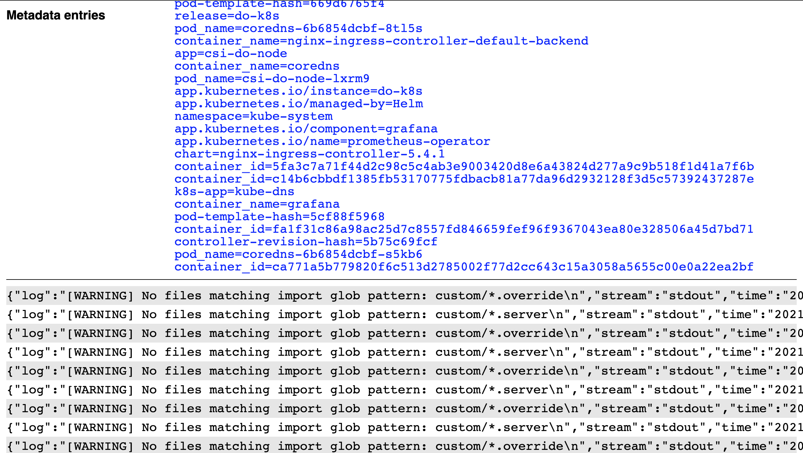

# Log collection part 15 (next steps)

Well, we set out to create a log collector, and lo, we have a log collector:



It's definitely not feature complete, and we've left a substantial amount of technical debt in our wake.
Let's list out what we can think of as possible next steps.

## Handle log rotation

This is one of the first problems we looked at, way back in the [2nd post](02-log-collection-part-2-aborted.md)!
We've barely thought about it since then, however, since it turns out to be a fairly small part of the overall problem.
In an (admittedly very quiet) cluster, after a week only two container logs have rotated.
Our monitor will be holding a watch and an open file for those two rotated logs which should no longer be written to (and may even no longer exist on disk).

How could we handle it?
We might start by adding watches for file deletions to `Watcher::watch_directory`.
This would assume that when Kubernetes rotates a log file, or a container restarts, the existing 'live' log will be deleted from the `root_path`.
We'd then have to reconcile this when handling the event in `directory::Collector`.

Alternatively (or additionally), we could expire `WatchedFile`s after period of inactivity.
If the file turns out to be active, we could simply re-open it in response to future writes - though we probably wouldn't get these events from the directory watch meaning we may also have to periodically re-scan the directory for activity.
In any case, we'd need to be able to checkpoint our offset in the file in order to avoid missing writes when the `WatchedFile` is 'paged out'.

However we might approach it, the current situation is Obviously not good enough for a finished version, but whilst we're essentially still prototyping we can easily live with this and occasionally restart the collector, if necessary.

## Introduce a query language (and/or more advanced queries)

Our `log_collector::Database` currently has one mechanism for retrieving data:

```rust
pub fn query(&self, key: &str, value: &str) -> io::Result<Option<Vec<String>>> {}
```

The only interaction with this is from our API:

```rust
let key = req.param("key")?;
let value = req.param("value")?;
...
database.query(key, value)?
```

So there's no common language between the layers – we just extract a `key` and `value` from the request and use that to interact with the database.

Whilst there's not really a problem with this, having a 'query language' would give us a stable interface around which we could change the database internals or the client behaviour whilst remaining compatible.
It would also make it easier to support more complicated queries.
We could imagine having some kind of `Query` type:

```rust
pub enum Query {
    Atom {
        key: &str,
        value: &str,
    },
    Conjunction {
        left: Box<Query>,
        right: Box<Query>,
    },
    Disjunction {
        left: Box<Query>,
        right: Box<Query>
    }
}
```

`Database` could easily have a function to query by this `enum` (if we ignore how we would actually implement it efficiently), e.g.:

```rust
pub fn query(&self, query: &Query) -> io::Result<Option<Vec<String>>> {}
```

But how would the API handle it?
We could leave this up to the API, but that would leave it subject to changes in the `Query` structure.
Or, we could add (de)serialization logic to `Query` itself, perhaps with just `FromStr` and `ToString` which would let us [`parse`](https://doc.rust-lang.org/stable/std/primitive.str.html#method.parse) strings into queries.
The serialization format would exactly be our query language!

Whilst we could look at this as a next step, it doesn't gain us much in terms of functionality, and would create additional surface area that we'd have to maintain through refactorings etc.
As such, we can leave this as it is for the moment and come back to it later.

## Record timestamps for log entries

Currently, the only information we store for log entries are their metadata and the log line itself.
In particular, we do not store any timestamp information.
Many loggers will put a timestamp in the log message, but our system treats log lines as opaque strings so we have no way of operating on the timestamps.

We would need timestamps if we want to 'fix' cross-container queries.
E.g. a query for `namespace=kube-system` will return the logs from all containers in the `kube-system` namespace, but they will be 'grouped' by container, rather than sorted by timestamp.
This prevents us from retrieving the 'logical stream' of log messages from multiple containers.

We could 'quite easily' (famous last words) add timestamp to `LogEntry` and set it on construction, but things get more interesting when we get to storing them in the database.
The simplest thing we could do is write `(timestamp, line)` to our data files (rather than just `line` currently).
Fundamentally this should work reasonably well – it would allow us to merge entries from multiple files in timestamp order by scanning the files concurrently, and we could include them in API responses for use by clients.
It would be less ideal if we supported filtering by timestamp, in which case we would still have to scan the bytes of all lines up to the target timestamp range, though this could perhaps be mitigated by sharding our data files by timestamp (and is anyway a hypothetical problem at this point).

We could also consider using a dedicated embedded database, such as [sled](https://docs.rs/sled), but until we're more worried about atomicity, or think it will solve a performance issue, we might as well avoid the dependency for now.

This could be a fairly 'low hanging fruit' to boost the capabilities of our system.

## Retrieve metadata for log entries

The interface to our collected logs is limited to queries for logs with a particular `key=value` in their metadata.
In particular, when retrieving logs we only fetch the lines, so it's impossible (or at least, very expensive) for clients to know what other metadata applies to a line in the log (e.g. which container the log came from).
In an ideal world, the client could find out what metadata is applicable for each log line in order to support interface improvements (such as annotating the container name of log messages).

The most naive way of doing this would be to include the metadata with each line in the API response – e.g. rather than returning an array of strings we might return an array of `{line, metadata}` objects.
This would of course be incredibly inefficient for payload sizes, since metadata could be as large as or larger than the log lines in most cases.
We could resolve that in one of two ways:

- 'Normalise' the metadata.
  In this case our response might look like `{metadatas, lines}`, where `metadatas` would be a lookup table from some reference to a set of metadata, and `lines` would be an array of `{metadata_ref, line}` structures.
  Of course, even in this format there would be a lot of waste – particularly for a JSON payload where the line structure would need to be encoded.

- Return unmerged responses.
  In this case, we would not merge lines from multiple files but instead would return an array of `{metadata, lines}` objects, one for each file.
  This would force clients to performing merging if they want a single stream of logs, but would allow us to return data to clients close-to-optimally (apart from the top-level keys and quotes around lines).

The latter approach has the benefit that we get to represent the list of log lines as a plain array of strings – this is the most efficient JSON representation we could use.
However, requiring clients to do their own merging is not ideal, particularly for simple use-cases.
It feels like there's a real design trade-off in this.

Whichever route we take, we would need to change how we store metadata internally in order to return it efficiently.
Right now, to work out the metadata for a particular 'file key', we could have to scan the index and check if the 'file key' appears in each entry, collecting the index keys as we go to build the complete metadata object.
Since we store the metadata for a file key on disk, it would be easy enough to just keep that structure in memory as well.

This also could be fairly low hanging fruit for increasing the capabilities of the system, and in particular would unlock more options for the UI, such as showing additional columns besides 'line' or showing related metadata links that could be used to drill down.

## Reducing dependencies (and compile times)

We've allowed our dependencies to balloon a little bit.
In particular, when we introduced `kube` we became dependents of two async runtimes: `async_std` and `tokio`.
Both of these are substantial dependencies, and more importantly they have largely distinct dependency graphs despite covering the same functional areas (e.g. each has their own HTTP stacks).
Some quick analysis with `cargo tree` suggests that we currently have ~235 dependencies, including multiple versions of the same crate, in our tree.
`kube` by itself has ~112 dependencies in its tree, and although some may overlap with other packages this is still a huge number, and removing it would likely bring our total dependencies down by quite a bit.

Why does `kube` have so many dependencies?
Because it has a lot of functionality – certainly a lot more than we're using!
The headline summary for the crate states:

> Rust client for Kubernetes in the style of a more generic client-go, a runtime abstraction inspired by controller-runtime, and a derive macro for CRDs inspired by kubebuilder.

We are using only the "Rust client for Kubernetes" part, and of that only a [single method](https://docs.rs/kube/0.50.0/kube/api/struct.Api.html#method.get).
If we follow the source of that function it takes us through:

- [`Resource::get`](https://docs.rs/kube/0.50.0/src/kube/api/resource.rs.html#152-159) and [`Resource::make_url`](https://docs.rs/kube/0.50.0/src/kube/api/resource.rs.html#75-88) which are ultimately doing some fairly trivial URL construction.
- [`Client::request`](https://docs.rs/kube/0.50.0/src/kube/client/mod.rs.html#142-152) and [`Client::send`](https://docs.rs/kube/0.50.0/src/kube/client/mod.rs.html#68-89) which are sending a request for the constructed URL using [`tower`](https://docs.rs/tower/0.4.5/tower/).

It seems like we could quite easily replace this with an `async_std`-based HTTP client such as [`surf`](https://docs.rs/surf).
The fly in the ointment is the [`kube::Config`](https://docs.rs/kube/0.50.0/kube/struct.Config.html) struct, and particularly the [`infer`](https://docs.rs/kube/0.50.0/kube/struct.Config.html#method.infer) method – this is implementing kubeconfig/in-cluster environment loading, which has a fair amount to it and may itself be responsible for a non-trivial number of dependencies.
There does seem to be [some](https://github.com/clux/kube-rs/issues/204) [interest](https://github.com/clux/kube-rs/issues/406) in separating the 'config' elements into their own crate, but it's apparently not as simple as it sounds.

Whilst it would be nice to reduce our dependency tree, we might be better off waiting for something like [clux/kube-rs#406](https://github.com/clux/kube-rs/issues/406) to land than trying to implement Kubernetes config loading ourselves.
We could also choose to do something based on feature flags, since the in-cluster configuration handling is comparatively simple to general `kubeconfig` handling, but this would complicate our builds and dependencies in a different way.
*Or* we could choose to rely on something like `kubectl proxy` for out-of-cluster configuration, and thereby leverage `kubectl` for authentication handling.

The last option there could be workable, and since there's no timelines associated with spliting up `kube` it might be a better choice if we're serious about reducing our dependencies.
This might not be the lowest of the low hanging fruits, but it could accelerate us going forward if it substantially reduced compile-times.

## Improve error handling

We're doing a lot of `unwrap`ping in `kubernetes::Collector` that would cause the system to crash in the event of transient issues (like being unable to reach the Kubernetes API) or 'bad input' (like files with unexpected names).
Furthermore we've limited ourselves to using `io::Error` for errors, meaning we have no way of distinguishing between 'fatal' and non-fatal errors and so all errors eventually bubble up to `main` and crash the program.

At some point, we should think more carefully about error handling by considering what errors are possible in each module and whether or not they're likely to be permanent/symptomatic of larger problems or something that a client could reasonably retry or otherwise recover.
From this we should be able to design a better `Error` type (or types) for our use.
For now, since our overall architecture is likely to fluctuate in the short term, we might reasonably fear that investing in error handling might make it harder to refactor our system.

## Deployment improvements

There are a couple of things we might consider improving with our `make deploy` task and associated artifacts:

- We could use a `PersistentVolume` for the `.data` directory.
  This would allow us to deploy new version of `monitoring-rs`, or restart failed pods/containers, without losing all our collected data.
  This would also give us a better hope of seeing how the system behaves as it reaches larger and larger volumes of stored data (including rebuilding state on start-up, etc.).

- We could label our resources and use `kubectl apply --prune` to give us better declarative deployments.
  Combined with a suitable naming scheme this might let us conveniently roll `PersistentVolume`s when the disk format changes, rather than having to manually delete them.

These would be super-low-hanging fruit, but put us in a better position to leave a running log collector alone whilst working on something else.

## Introduce metric collection

In the spirit of 'going wide' we could start to think about introducing metric collection to our system – as opposed to 'going deep' on log collection, and making it more difficult to add metric collection later.
This would give us an entirely new functional area, as well as giving us more insight into the commonalities and divergences between log collection and metric collection that might lead us to a better architecture.

This may also have 'synergies' with other things we've talked about, like storing timestamps.
We would almost certainly need to store timestamps for metrics to be useful, and doing so for metrics might give us ideas for logs (or we may even share the implementation).

## Which seat should we take?

We will need to look at most of the things we've talked about at some point in order to consider `monitoring-rs` 'finished', but what should we look at next?
Given the current state of the project, two options seem sensible:

- **Deployment improvements**: Picking these up would give us some confidence that we can leave our log collector running whilst we work on something else.
  In particular, backing the `.data` folder with a `PersistentVolume` would let us deploy new versions without losing the logs we've collected so far – and force us to deal with breaking changes in the database format we would be good to experience.

- **Introduce metric collection**: Since we're currently in a bit of a 'prototyping' phase it would make sense to continue 'sketching out' the whole system before going too far with one aspect of it.
  This would interact particularly badly with other possibilities like improving error handling, since this might further commit us to an architecture that's designed around just one aspect.

## Adding persistent

Without further ado, let's add persistence to our `monitoring-rs` deployment.
The sooner we do this, the better, since introducing persistence will require us to throw away the data we have so far.

We can start by adding a `PersistentVolumeClaim` to our `deployment/kubernetes.yaml`:

```diff
--- a/deployment/kubernetes.yaml
+++ b/deployment/kubernetes.yaml
@@ -29,6 +29,18 @@ roleRef:
   name: monitoring-rs
   apiGroup: rbac.authorization.k8s.io
 ---
+apiVersion: v1
+kind: PersistentVolumeClaim
+metadata:
+  name: monitoring-rs-data
+spec:
+  accessModes:
+  - ReadWriteOnce
+  resources:
+    requests:
+      storage: 1Gi
+  storageClassName: do-block-storage
+---
 apiVersion: apps/v1
 kind: Deployment
 metadata:
```

Now we can reference that volume claim from our `Deployment`:

```diff
--- a/deployment/kubernetes.yaml
+++ b/deployment/kubernetes.yaml
@@ -69,6 +69,9 @@ spec:
           mountPath: /var/lib/docker/containers
           readOnly: true
       volumes:
+      - name: data
+        persistentVolumeClaim:
+          claimName: monitoring-rs-data
       - name: varlog
         hostPath:
           path: /var/log
```

Now all we should have to do is deploy it 🤞 (make sure to first bid adieu to any logs collected so far):

```
$ make deploy
...
serviceaccount/monitoring-rs unchanged
clusterrole.rbac.authorization.k8s.io/monitoring-rs unchanged
clusterrolebinding.rbac.authorization.k8s.io/monitoring-rs unchanged
persistentvolumeclaim/monitoring-rs-data created
deployment.apps/monitoring-rs configured

$ kubectl -n monitoring-rs get pods
NAME                             READY   STATUS        RESTARTS   AGE
monitoring-rs-64cf454fcc-p66fq   0/1     Terminating   1          6d18h
monitoring-rs-6fb5b4bd55-ptczk   1/1     Running       0          12s

$ kubectl -n monitoring-rs get pv
NAME                                       CAPACITY   ACCESS MODES   RECLAIM POLICY   STATUS   CLAIM                              STORAGECLASS       REASON   AGE
pvc-42a5ec54-c8fb-40ea-a830-d30a61761772   10Gi       RWO            Delete           Bound    do-k8s/do-k8s-grafana              do-block-storage            205d
pvc-a5595f6a-1024-49be-bdb6-14190e492d80   1Gi        RWO            Delete           Bound    monitoring-rs/monitoring-rs-data   do-block-storage            14s
```

Very cool.
Now let's pick the first log entry from, e.g., the `kube-system` namespace:

```
$ kubectl -n monitoring-rs port-forward monitoring-rs-6fb5b4bd55-ptczk 8000
Forwarding from 127.0.0.1:8000 -> 8000
Forwarding from [::1]:8000 -> 8000

# in another tab
$ eg_log="$(curl http://localhost:8000/logs/namespace/kube-system | jq -r first)"
$ echo "$eg_log"
{"log":"[WARNING] No files matching import glob pattern: custom/*.override\n","stream":"stdout","time":"2021-02-15T18:15:36.862298375Z"}
```

Conveniently this also has a timestamp in it.
Now let's restart the `monitoring-rs` pod by deleting the current one:

```
$ kubectl -n monitoring-rs delete pods monitoring-rs-6fb5b4bd55-ptczk
$ kubectl -n monitoring-rs get pods
kubectl -n monitoring-rs get pods
NAME                             READY   STATUS    RESTARTS   AGE
monitoring-rs-6fb5b4bd55-b98d8   1/1     Running   0          34s
```

Now we can check if our `eg_log` is still present in the `kube-system` logs:

```
$ kubectl -n monitoring-rs port-forward monitoring-rs-6fb5b4bd55-b98d8 8000
Forwarding from 127.0.0.1:8000 -> 8000
Forwarding from [::1]:8000 -> 8000

# in a tab with `$eg_log` set
$ curl http://localhost:8000/logs/namespace/kube-system | jq 'contains('"$eg_log"' | [. | tostring])'
false

$ curl http://localhost:8000/logs/namespace/kube-system | jq first
"{\"log\":\"[WARNING] No files matching import glob pattern: custom/*.override\\n\",\"stream\":\"stdout\",\"time\":\"2021-02-15T18:20:46.892256135Z\"}"
```

Boo.
We've reset the data.
This might prompt us to review our `Deployment` template spec:

```yaml
spec:
  serviceAccountName: monitoring-rs
  containers:
  - name: monitoring-rs
    image: $DOCKER_DIGEST
    volumeMounts:
    - name: varlog
      mountPath: /var/log
      readOnly: true
    - name: varlibdockercontainers
      mountPath: /var/lib/docker/containers
      readOnly: true
  volumes:
  - name: data
    persistentVolumeClaim:
      claimName: monitoring-rs-data
  - name: varlog
    hostPath:
      path: /var/log
      type: Directory
  - name: varlibdockercontainers
    hostPath:
      path: /var/lib/docker/containers
      type: Directory
```

So for the `varlog` and `varlogcontainers` volumes we've also specified them in the container's `volumeMounts`, along with the path they should be mounted at.
That's probably what we've missed for our `data` volume.

We need to mount the `data` volume at `$PWD/.data`.
Since we're not explicitly setting a `WORKDIR` in our `Dockerfile`, and the `alpine` image *also* doesn't set one, our working directory should be the docker default (`/`), so let's go ahead and mount it:

```diff
--- a/deployment/kubernetes.yaml
+++ b/deployment/kubernetes.yaml
@@ -62,6 +62,8 @@ spec:
       - name: monitoring-rs
         image: $DOCKER_DIGEST
         volumeMounts:
+        - name: data
+          mountPath: /.data
         - name: varlog
           mountPath: /var/log
           readOnly: true
```

Now let's deploy again:

```
$ make deploy
serviceaccount/monitoring-rs unchanged
clusterrole.rbac.authorization.k8s.io/monitoring-rs unchanged
clusterrolebinding.rbac.authorization.k8s.io/monitoring-rs unchanged
persistentvolumeclaim/monitoring-rs-data unchanged
deployment.apps/monitoring-rs configured

$ kubectl -n monitoring-rs get pods
NAME                             READY   STATUS    RESTARTS   AGE
monitoring-rs-5fd95bddf4-c56g4   0/1     Error     0          19s
monitoring-rs-6fb5b4bd55-b98d8   1/1     Running   0          13m

$ kubectl -n monitoring-rs logs monitoring-rs-5fd95bddf4-c56g4
Error: Custom { kind: Other, error: "invalid data file /.data/lost+found: extension must be `dat` or `json`" }
```

Oh no – it looks like there's a file already in there and that's triggering our very conservative data loading.
The fastest way to resolve this would be to use the `subPath` field to get a (hopefully) empty directory within the volume:

```diff
--- a/deployment/kubernetes.yaml
+++ b/deployment/kubernetes.yaml
@@ -64,6 +64,7 @@ spec:
         volumeMounts:
         - name: data
           mountPath: /.data
+          subPath: .data
         - name: varlog
           mountPath: /var/log
           readOnly: true
```

Once more through the loop:

```
$ make deploy
serviceaccount/monitoring-rs unchanged
clusterrole.rbac.authorization.k8s.io/monitoring-rs unchanged
clusterrolebinding.rbac.authorization.k8s.io/monitoring-rs unchanged
persistentvolumeclaim/monitoring-rs-data unchanged
deployment.apps/monitoring-rs configured

$ kubectl -n monitoring-rs get pods
NAME                             READY   STATUS        RESTARTS   AGE
monitoring-rs-5fd95bddf4-c56g4   0/1     Terminating   5          5m2s
monitoring-rs-6878788b9b-s6vcm   1/1     Running       0          7s
```

Better!
Now let's again pluck an example log from the `kube-system` namespace and restart the pod:

```
$ kubectl -n monitoring-rs port-forward monitoring-rs-6878788b9b-s6vcm 8000
Forwarding from 127.0.0.1:8000 -> 8000
Forwarding from [::1]:8000 -> 8000

# in another tab
$ eg_log="$(curl http://localhost:8000/logs/namespace/kube-system | jq first)
$ echo "$eg_log"
"{\"log\":\"level=info msg=\\\"Delete endpoint request\\\" id=\\\"container-id:db34e6c03c5a0976106aba55ab8f180e1264353c1fbbecb97433e6b4c5089b42\\\" subsys=daemon\\n\",\"stream\":\"stderr\",\"time\":\"2021-02-15T18:38:31.391035175Z\"}"
```

Once again we have a timestamp, which is ideal.
Now let's again restart the pod and see if our log has carried over:

```
$ kubectl -n monitoring-rs delete pods monitoring-rs-6878788b9b-s6vcm
pod "monitoring-rs-6878788b9b-s6vcm" deleted

$ kubectl -n monitoring-rs get pods
NAME                             READY   STATUS    RESTARTS   AGE
monitoring-rs-6878788b9b-v99fl   1/1     Running   0          16s

$ kubectl -n monitoring-rs port-forward monitoring-rs-6878788b9b-v99fl 8000
Forwarding from 127.0.0.1:8000 -> 8000
Forwarding from [::1]:8000 -> 8000

# in a tab with `$eg_log` set
$ curl http://localhost:8000/logs/namespace/kube-system | jq "first == $eg_log"
true
```

Hurray 🎉

## Wrapping up log collection (for now)

With that, let's conclude our current "Log collection" series, with the expectation of starting up a "Metric collection" series next time.
We've come pretty far from our [first steps](01-log-collection-part-1.md) – if we expand our early requirements we've ticked off a lot of the logging ones with our prototype:

- ✅ Accept logs from Kubernetes.
- ✅ Store those logs in a format suitable for searching.
- ✅ Provide an API and UI for searching and visualising ingested logs.

We're left with:

- ❌ Accept metrics from Kubernetes.
- ❌ Store metrics in a format suitable for searching and alerting.
- ❌ Provide an API and UI for searching and visualising ingested metrics.
- ❌ Provide an API and UI for configuring alert rules based on incoming metrics.

Exciting stuff!
